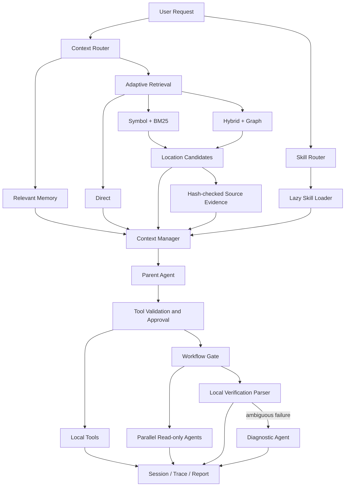
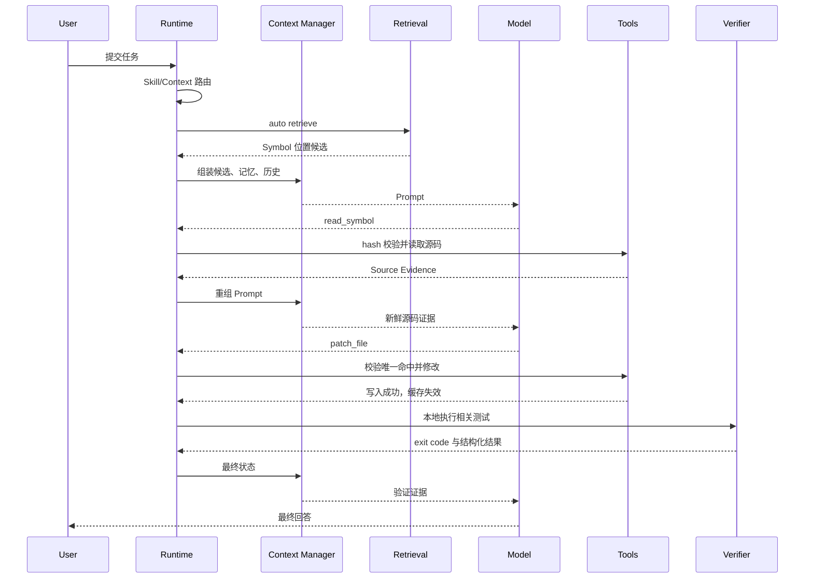

# Bingo 项目面试深挖手册

> 适用版本：当前仓库源码
> 最近核验：2026-09-11
> 用途：项目介绍、技术追问、系统设计讨论、现场演示与简历数据解释

这份文档以当前实现为准。面试时不要背模块清单，要围绕四个问题展开：系统解决了什么问题，为什么这样设计，关键边界如何保证，数据是否支持结论。

---

## 1. 项目定位

### 1.1 一句话介绍

Bingo 是一个运行在本地代码仓库中的 Coding Agent Runtime。它围绕大模型实现了可控的执行循环，并通过自适应代码检索、AST Symbol Graph、分层上下文、按需 Skill 和有门控的多 Agent Workflow，在检索质量、上下文成本、执行安全与可复现评测之间做工程化平衡。

### 1.2 30 秒介绍

> 我做的是一个面向真实代码仓库的本地 Coding Agent。模型只负责需要语义理解和推理的部分，Runtime 负责 Prompt 组装、工具校验、执行、状态恢复和审计。代码检索会根据仓库规模、查询类型和上下文预算，在直接加载、Symbol、BM25、向量和 Hybrid 之间自适应选择；向量库只存 Symbol 短卡，命中后再按哈希读取源码。Skill 只在匹配后加载，多 Agent 也只在跨模块并行调查或复杂诊断确实有收益时启用。项目有 218 个通过的自动化测试，并保留真实仓库检索的负向消融结果。

### 1.3 2 分钟介绍

> 这个项目的核心不是简单地调用一次大模型 API，而是实现一个 Agent Harness。每次用户请求都会进入一个有步数上限的控制循环：先路由 Skill 和上下文，再组装稳定前缀、工作状态、相关记忆、检索候选、源码证据和历史，调用模型后解析成单个工具动作或最终回答。工具执行前会经过 schema、路径、权限和审批校验，结果再写入 Session、TaskState、Trace、Report、Memory 或 Evidence Cache。
>
> 检索方面，我没有对所有仓库盲目使用 RAG。小仓库概览或明确文件且内容能装入预算时直接加载；精确标识符和调用关系优先走 Symbol 与 BM25；语义查询先做便宜的一阶段检索，证据不足才升级到 Hybrid。Python 文件通过 AST 提取类、函数、方法、嵌套函数、签名、父子关系、调用和继承关系。Embedding 的对象不是完整代码正文，而是每个 Symbol 最多两张 1,200 字符的 identity/behavior 短卡，命中后用 symbol_id、行号和文件哈希读取当前源码。
>
> 为避免上下文重复，我把 Memory、Retrieval Candidate 和 Source Evidence 分开：Memory 只保存跨轮次有价值的状态与决策；检索候选只回答可能读哪里；Source Evidence 保存已经实际读取并通过哈希校验的源码。Skill 和多 Agent 也采用按需策略。测试执行先由本地进程完成，标准错误用正则提取，只有多失败、跨模块或非结构化错误才调用诊断子 Agent。完整日志无损落盘，父 Agent 只接收有界的结构化摘要和引用。

### 1.4 面试时最值得强调的三个点

1. **自适应而不是固定 RAG**：通过仓库规模、查询类型、路径范围、证据充分度和预算选择检索策略。
2. **位置检索与源码阅读分离**：Embedding 负责召回，哈希校验后的工具负责提供事实证据。
3. **确定性逻辑优先于模型调用**：权限检查、路径约束、测试解析、去重、预算、持久化均由本地代码控制。

---

## 2. 问题背景与设计目标

普通 Agent 原型常见以下问题：

| 问题 | 直接后果 | Bingo 的处理 |
|---|---|---|
| 启动就读取整个仓库 | 小仓库浪费，大仓库爆上下文 | 按规模与范围选择 Direct 或检索 |
| 所有查询都走向量库 | 精确符号查询变慢且不稳定 | Symbol/BM25 优先，弱证据再升级 |
| Embedding 完整源码 | 长正文稀释语义，索引成本高 | 每个 Symbol 两张短语义卡 |
| 检索结果直接当事实 | 索引可能过期 | symbol_id + SHA-256 二阶段读取 |
| Memory 与代码检索混用 | 同一源码重复进入 Prompt | 工作状态、相关记忆、候选、证据分层 |
| 所有任务都创建子 Agent | 调用成本高，整合复杂 | 父 Agent、本地算法、子 Agent 三层门控 |
| 测试日志全部交给模型 | 上下文膨胀 | 本地正则提取，原始日志无损落盘 |
| 模型直接操作系统 | 路径逃逸、误写、命令风险 | 工具白名单、参数校验、审批和只读子 Agent |
| 只展示成功样例 | 无法判断真实工程效果 | 固定清单、Verifier、Trace、消融和失败报告 |

设计目标不是追求“模型调用最多”，而是让每次模型调用处理本地算法难以可靠完成的部分。

---

## 3. 总体架构

### 3.1 分层视图

```text
Interface Layer
  CLI / REPL / one-shot command
          |
Control Layer
  Bingo Runtime / TaskState / stopping rules / approval
          |
Context Layer
  Context Router / Context Manager / Prompt Cache
          |
Knowledge Layer
  Adaptive Retrieval / Symbol Graph / Memory / Evidence Cache / Skills
          |
Execution Layer
  File Tools / Shell / Workflow Engine / Read-only Child Agents
          |
Observability Layer
  Session / Checkpoint / Trace / Report / Benchmark Artifacts
```

### 3.2 运行链路



### 3.3 核心模块

| 模块 | 主要职责 | 面试切入点 |
|---|---|---|
| `bingo/cli.py` | 参数解析、Provider 选择、Agent 构建 | 外部配置与 Runtime 解耦 |
| `bingo/runtime.py` | 主循环、停止条件、工具调度、状态更新 | Agent Harness 核心 |
| `bingo/context_manager.py` | 分区预算、压缩、Prompt 装配 | 控制上下文成本 |
| `bingo/context_router.py` | 判断是否需要代码检索和记忆召回 | 可解释的轻量路由 |
| `bingo/retrieval_corpus.py` | 文件枚举、Chunk、AST、Symbol Graph、SQLite 索引 | 检索语料层 |
| `bingo/retrieval.py` | Direct/Symbol/BM25/Vector/Hybrid 路由与融合 | 自适应检索核心 |
| `bingo/evidence_cache.py` | 已读源码缓存、哈希新鲜度、LRU | 候选与事实证据分离 |
| `bingo/memory.py` | 工作状态、过程笔记、持久决策 | Memory 的职责边界 |
| `bingo/skill_registry.py` | 只扫描 Skill 元数据 | 延迟加载第一阶段 |
| `bingo/skill_router.py` | 显式、alias、trigger 和元数据相关性路由 | 无匹配不强选 |
| `bingo/skill_loader.py` | 正文、资源加载与哈希复用 | 延迟加载第二阶段 |
| `bingo/workflow_engine.py` | 并行调查、验证和诊断门控 | 多 Agent 有界使用 |
| `bingo/verification_parser.py` | 本地解析测试计数和失败卡片 | 本地算法优先 |
| `bingo/workflow_store.py` | 无损工件和有界回读 | 防止摘要丢失信息 |
| `bingo/models.py` | 多 Provider 适配、重试、usage、clone | 模型后端隔离 |
| `bingo/tools.py` | 工具 schema、验证、执行函数 | 能力白名单与安全边界 |
| `bingo/task_state.py` | 单次请求状态机 | attempts 与 tool_steps 分离 |
| `bingo/run_store.py` | TaskState、Trace、Report 原子落盘 | 可恢复与可审计 |
| `bingo/real_benchmark.py` | 真实仓库 E2E、检索消融和报告 | 数据可信度 |

---

## 4. Runtime：模型外面的确定性控制层

### 4.1 为什么需要 Runtime

大模型擅长理解意图和推理，但不适合独自保证以下事情：

- 每次只执行一个合法动作；
- 文件路径不能逃出工作区；
- 写操作是否需要审批；
- 工具调用是否重复；
- 何时因步数、重试或错误停止；
- 哪些状态需要持久化；
- 检索证据是否已经过期；
- 测试成功是否真的由命令退出码证明。

因此 Runtime 把模型输出当作“不可信的动作建议”，经过解析和校验后才执行。

### 4.2 `Bingo.ask()` 主循环

```text
activate Skills
  -> update task summary
  -> create TaskState and run directory
  -> build Prompt
  -> model.complete()
  -> parse one tool call or final answer
  -> validate tool
  -> approval/read-only/allowlist check
  -> execute
  -> update History, Memory, Evidence Cache, Checkpoint and Trace
  -> next model step
```

关键限制：

- 默认 `max_steps=6`；
- 最大模型尝试次数为 `max(max_steps * 3, max_steps + 4)`；
- `attempts` 统计模型调用轮次；
- `tool_steps` 只统计真正进入执行阶段的工具调用；
- 最终停止原因单独记录，如正常回答、步数耗尽、重试耗尽、模型错误或审批拒绝。

### 4.3 为什么区分 attempts 和 tool_steps

模型可能输出无法解析的内容，Runtime 会要求重试，但这次没有真正执行工具。如果只记录一个 step，就无法区分“模型协议失败”和“工具链执行过多”。分开记录后，评测可以判断问题来自模型输出稳定性还是 Agent 行动效率。

### 4.4 模型输出协议

模型每轮只能返回一个工具调用或最终回答。工具调用采用结构化 JSON/XML 包装，由 Runtime 解析；解析失败不会直接执行自然语言中的命令。

这样做的价值：

- 动作边界明确；
- 参数可以做类型和范围校验；
- Trace 可以稳定记录；
- 测试可以覆盖错误协议；
- 模型无法通过普通文本绕过工具系统。

### 4.5 状态与工件

```text
.bingo/
├── sessions/<session_id>.json
├── runs/<run_id>/
│   ├── task_state.json
│   ├── trace.jsonl
│   ├── report.json
│   └── workflows/
├── memory/
└── retrieval/index.sqlite3
```

- **Session**：用于跨轮次恢复，保存 History、Memory、Skill 加载状态、Evidence Cache 和 Checkpoint 索引。
- **TaskState**：描述一次 `ask()` 当前走到哪里。
- **Trace**：按事件追加 JSONL，适合流式写入和故障定位。
- **Report**：运行结束后的汇总。
- **Workflow Artifact**：保存完整 stdout、stderr 和子 Agent 原始结果。

RunStore 对 JSON 采用“临时文件写入后 replace”的原子写方式，避免进程中断留下半截状态。

---

## 5. 自适应检索

### 5.1 自适应的决策变量

检索入口是 `RetrievalEngine.search()`，主要观察：

1. **仓库规模**：按 Chunk 数分为 small、medium、large；
2. **查询类型**：关系、限定符号、标识符、位置或语义；
3. **路径范围**：用户是否明确指定文件或目录；
4. **上下文预算**：范围内完整内容能否装入；
5. **一阶段证据强度**：Symbol 与 BM25 是否已经共同覆盖主要查询词；
6. **向量后端状态**：是否配置、是否可用、覆盖率是否完整；
7. **ANN 质量**：大仓库 HNSW 结果相似度不足时是否回退精确余弦。

默认规模阈值：

| 档位 | Chunk 数 |
|---|---:|
| small | `≤ 200` |
| medium | `201～5000` |
| large | `> 5000` |

这些是可通过环境变量调整的工程默认值，不是理论上唯一正确的分界。

### 5.2 查询分类

| query_type | 典型输入 | 主要策略 |
|---|---|---|
| `qualified_symbol` | `ContextManager.build` | 精确 Symbol |
| `identifier` | `pack_hits` | Symbol + BM25 |
| `relationship` | “谁调用了 pack_hits” | Symbol + 一跳 Graph |
| `location` | `bingo/runtime.py` | 范围直接加载或关键词 |
| `semantic` | “哪里处理过期源码证据” | 便宜检索，弱证据升级 Hybrid |

当前分类由确定性正则完成，优点是快、可解释、可测试；缺点是复杂自然语言可能分类不准，这也是 Auto 指标仍需优化的原因之一。

### 5.3 Auto 路由逻辑

```text
明确文件/目录且内容可装入，或小仓库概览
  -> Direct

精确 Symbol
  -> Symbol

调用/继承关系
  -> Symbol + Graph

单个标识符
  -> Symbol + BM25

一般语义查询
  -> Symbol + BM25 first pass
       |
       +-- 证据充分 -> Keyword 路径结束
       |
       +-- 证据不足 -> Hybrid(Symbol + BM25 + Vector)
```

这体现“便宜路径优先、证据不足再升级”。如果 Embedding 未配置或调用失败，Hybrid 自动降级到 Keyword，并通过 `fallback_reason` 记录原因。

### 5.4 为什么保留 Direct

RAG 不是目的。对于一个几十个 Chunk 的仓库，建立向量索引和进行召回可能比直接读取更慢，还会丢失全局结构。当指定文件、指定目录，或小仓库概览范围能完整装入预算时，Direct 能提供无召回损失的上下文。

### 5.5 Symbol、BM25、Vector 和 Graph 各自解决什么问题

| 通道 | 擅长场景 | 主要缺点 |
|---|---|---|
| Symbol | 精确函数名、方法名、签名 | 不理解自然语言语义 |
| BM25/FTS5 | 错误字符串、关键字、路径、标识符 | 跨语言或同义表达弱 |
| Vector | 自然语言描述、中文到英文代码语义 | 排名可能被相似但不关键的概念干扰 |
| Graph | 调用、包含、继承邻居 | 静态解析不等于运行时真实调用 |
| Direct | 小范围完整事实 | 范围大时占用上下文 |

### 5.6 Hybrid 融合

各通道先独立排序，再使用带通道权重的 Reciprocal Rank Fusion：

```text
score(d) = Σ channel_weight / (60 + rank_channel(d))
```

当前权重大致为：

- Symbol：1.2；
- Keyword：1.0；
- Vector：0.9；
- 关系查询追加 Graph：0.8。

RRF 不要求把 BM25 分数、余弦相似度和图置信度强行归一到同一数值空间，工程上更稳定。精确 qualified name 还会在最终排序中获得优先位置。

### 5.7 去重与结果多样性

融合后继续做以下处理：

- 同一通道内按 symbol_id 去重；
- 相同源码正文按 SHA-256 合并，并保留多个来源位置；
- 单文件最多保留 4 个结果；
- 同一父 Symbol 最多保留 3 个结果；
- Graph 默认只扩展一跳，fan-out 最大 8；
- 整个候选卡必须完整装入预算，绝不从中间截断一张卡；
- 返回前重新读取文件并核对 hash，过期候选计入 `stale_candidates` 后丢弃。

### 5.8 大仓库策略

大仓库根范围检索可以使用可选的 USearch HNSW：

- 索引构建参数固定；
- ANN 只用于 large tier；
- 最佳相似度低于默认 `0.55` 时回退精确余弦；
- 未安装、维度变化或运行异常均有显式 fallback；
- 精确余弦使用有界 top-k heap，不需要一次排序所有结果。

它支持规模扩展，但当前真实评测还没有覆盖足够多的大仓库，因此面试时应说“实现了大仓库路径和回退机制”，不要说“已经证明大仓库性能领先”。

---

## 6. AST Symbol Graph 与短卡 Embedding

### 6.1 Symbol 包含什么

Python AST 会提取：

- `class`；
- 顶层 `function`；
- 类内 `method`；
- `nested_function`；
- qualified name 和 simple name；
- 父 Symbol；
- 签名与 Docstring；
- 起止行号和文件 SHA-256；
- 有界的 calls、attributes、literals、returns、bases；
- contains、calls、inherits 边。

Symbol ID 使用 `path + qualified_name + kind` 的 SHA-256，因此同一文件同一符号的 ID 稳定；源码是否变化由独立的 `content_hash` 判断。

### 6.2 一个具体例子

假设源码：

```python
class SessionService(BaseService):
    """恢复并校验会话。"""

    def resume(self, session_id: str):
        data = self.store.load(session_id)
        return self.validator.check(data)
```

Symbol 表会包含两条记录：

```text
SessionService
  kind=class
  parent=""
  signature=SessionService(BaseService)
  bases=[BaseService]
  lines=1..6

SessionService.resume
  kind=method
  parent=SessionService
  signature=resume(self, session_id: str)
  calls=[self.store.load, self.validator.check]
  attributes=[self.store.load, self.store, self.validator.check, self.validator]
  returns=[return self.validator.check]
  lines=4..6
```

Graph 可能包含：

```text
SessionService --contains--> SessionService.resume
SessionService --inherits--> BaseService       # 仅当目标可唯一解析
SessionService.resume --calls--> 某目标         # 仅当名称可唯一解析
```

### 6.3 哪些内容进入 Embedding

每个 Symbol 最多生成两张卡：

```text
identity card
  kind
  qualified_name
  parent
  signature
  module

behavior card
  qualified_name
  purpose/docstring
  calls
  attributes
  bounded literals
  returns
```

边界如下：

| 字段 | 上限 |
|---|---:|
| signature | 160 字符 |
| docstring | 240 字符 |
| calls | 12 项 |
| attributes | 10 项 |
| literals | 6 项 |
| 单张卡 | 1,200 字符 |

完整源码、行号、文件 hash、密钥形态字符串以及无界方法体不进入 Embedding。数据库仍保存源码 Chunk 供 BM25 和定位使用，但旧的完整 Chunk 向量表会在迁移时清空。

### 6.4 为什么不是只存位置、完全不用代码语义

只保存位置能让模型在候选产生后读取源码，但仍需要一个机制从成千上万个位置中找出候选。精确符号和 BM25 能解决一部分问题，中文自然语言与英文实现、同义描述和跨模块概念查询则需要语义召回。

因此这里采用折中方案：

- 向量只编码短小、稳定、可解释的 Symbol 语义；
- 位置和 hash 作为 metadata；
- 真正用于修改判断的源码通过工具按需读取。

Embedding 用来“找位置”，源码工具用来“建立事实”。

### 6.5 Graph 的保守边界

静态 AST 无法准确还原动态分派、依赖注入、反射、猴子补丁和运行时生成代码。当前实现只解析：

- 同文件可唯一确定的目标；
- 全库 simple name 唯一的目标；
- `self.x`、`cls.x` 可映射到当前类成员的目标。

有歧义就不连边。面试时应称它为“高精度、有限召回的一跳静态 Symbol Graph”，不能把它说成完整调用图。

### 6.6 非 Python 文件怎么办

非 Python 文件仍会进入文件枚举、Chunk 和 FTS5 关键词索引，也能 Direct 读取；当前 AST Symbol 抽取仅支持 Python。这是明确的实现边界。扩展方向是为 TypeScript、Java、Go 等语言接入 Tree-sitter，并复用统一 Symbol Schema。

---

## 7. Context、Memory 与 Source Evidence

### 7.1 三者的职责

| 数据 | 回答的问题 | 生命周期 | 是否含源码正文 |
|---|---|---|---:|
| Working State | 当前任务在做什么、最近碰过哪些文件 | 当前会话 | 否 |
| Relevant Memory | 以前有哪些决定、偏好或稳定事实与本轮相关 | 跨轮次/可持久 | 原则上否 |
| Retrieval Candidate | 这轮可能应该读取哪些位置 | 当前检索 | 否，Direct 例外 |
| Source Evidence | 哪些源码已经真实读取且仍然新鲜 | 当前会话缓存 | 是 |
| Transcript | 模型和工具刚刚做了什么 | 当前会话 | 可能包含压缩结果 |
| Skill | 该类任务应该采用什么流程 | 当前请求激活 | 指令和按需资源 |

最关键的边界是：**Memory 不承担代码正文缓存，Evidence Cache 不承担长期知识记忆。**

### 7.2 Memory 的实际作用

Memory 保存的是未来轮次仍有价值的信息：

- 当前任务摘要；
- 最近访问文件名；
- 有界的 episodic/process note；
- 文件摘要及 freshness；
- 长期项目约定；
- 关键决策；
- 依赖事实；
- 用户偏好。

Working State 渲染时只展示 recent files、笔记数量和 durable topic，不把全部笔记正文铺开。只有查询与某条记忆发生 token/tag 命中时，才在 Relevant Memory 中最多召回 3 条。

### 7.3 Relevant Memory 是否与代码检索重复

经过当前优化后，代码派生笔记会从 Relevant Memory 候选中过滤。源码的位置和正文由 Retrieval/Evidence 负责；Relevant Memory 主要召回人为决策、过程结论、约定和偏好。

路由示例：

- “哪里实现了缓存失效” → 代码检索；
- “我们上次为什么决定用 SHA-256” → Memory；
- “按照上次约定修改缓存失效代码” → Mixed，同时用 Memory 和代码检索；
- “继续刚才的任务” → Resume/TaskState。

### 7.4 Evidence Cache

Evidence Cache 保存 `path + line range + content + file hash + symbol_id`，并具有：

- SHA-256 新鲜度校验；
- 覆盖范围匹配；
- 修改文件后的按路径失效；
- 有界条目数；
- LRU 淘汰；
- 大正文截断时标记 `complete=false`，避免把不完整缓存当作完整命中。

检索候选命中后，Context Manager 只注入仍与候选来源及 hash 匹配的 Evidence。文件在外部被修改时，旧 Evidence 会被清除并记录失效元数据。

### 7.5 去除上下文重复

Context Manager 会避免以下重复：

- Source Evidence 已覆盖的历史 `read_file`；
- Direct Retrieval 已包含的相同内容；
- 相同 durable/session memory 文本；
- 旧文件读取结果可被仍然新鲜的 file summary 替代；
- 老的 shell 输出只保留有界摘要。

这使“检索位置”“已读事实”“历史动作”各保留一次。

---

## 8. 48,000 字符上下文预算

### 8.1 为什么仍使用字符预算

字符数具有实现简单、Provider 无关、装配前即可计算的优点。不同模型 Tokenizer 不同，强行用一个 Token 估算器容易产生另一种不准确。当前检索同时检查字符数和 UTF-8 字节上界，而总 Prompt 使用字符预算。

面试时可以明确说明：这不是精确 Token 计费器，而是跨模型的确定性上限。生产化时可以为具体 Provider 插入 tokenizer，并保留字符硬上限作为第二道保护。

### 8.2 默认分区

| Section | 默认字符预算 | 作用 |
|---|---:|---|
| prefix | 6,000 | 系统规则、工具协议、Workspace 快照 |
| skill catalog | 2,000 | 可用 Skill 元数据 |
| active skills | 8,000 | 当前激活 Skill 正文 |
| memory | 1,800 | 紧凑 Working State |
| relevant memory | 1,200 | 最多 3 条相关记忆 |
| retrieval | 2,400 | 位置候选卡 |
| source evidence | 20,000 | 已读且新鲜的源码证据 |
| history | 7,000 | 当前任务必要交互 |
| current request | 不单独裁剪 | 当前用户请求 |

这些分区相加可能超过总预算，因为它们是各区上限，不代表每轮都会全部占满。最终 Prompt 必须受 `48,000` 字符总预算约束。

### 8.3 超预算时的压缩顺序

```text
skill_catalog
-> relevant_memory
-> retrieval
-> history
-> source_evidence
-> memory
-> prefix
```

各区还有 floor。当前请求不进入普通裁剪顺序。Skill 正文按完整块装入，空间不够时省略整块；Retrieval 和 Source Evidence 也尽量按完整证据单元装配，避免产生“半个函数”或“半条来源”。

### 8.4 为什么 Source Evidence 预算最大

Coding Agent 最终要修改代码，真实源码比摘要和候选分数更重要。Retrieval Candidate 只需告诉模型哪些位置值得读，因此预算较小；实际读到的源码证据需要容纳多个相关函数和测试，预算更大。

### 8.5 Prompt Cache

Runtime 会对稳定前缀计算签名，并只对明确支持缓存语义的 Provider 发送 cache key。动态 History 和当前请求不会被当成稳定前缀。Provider 返回的 input/output/cached token 元数据会进入 Trace 和 Report，用于判断缓存是否真正命中。

---

## 9. Skill 路由与按需加载

### 9.1 三阶段设计

```text
Discovery
  只读取 SKILL.md 有界 frontmatter
        |
Routing
  显式指定 / alias / trigger / metadata relevance
        |
Loading
  读取选中正文，执行时再读取声明资源
```

目录示例：

```text
.bingo/skills/
├── testing/
│   ├── SKILL.md
│   ├── references/
│   └── templates/
├── code-review/
└── multi-agent-workflow/
```

### 9.2 Registry 为什么不读取正文

如果启动时加载所有 Skill，Skill 数量增长会线性占用内存和 Prompt。Registry 最多扫描 128 个 Skill，每个 frontmatter 最多 8,192 字符，只注册：

- name；
- description；
- version；
- aliases；
- triggers；
- priority；
- allowed_tools；
- resources；
- metadata hash。

正文和资源在选中前不进入上下文。

### 9.3 当前语义匹配是不是 BM25

不是。SkillRouter 使用可解释的本地规则：

- alias 边界命中最高可给 0.9；
- trigger 子串命中从 0.55 起累计；
- 查询词与 metadata routing text 做集合重叠；
- 中文请求补充字符 bigram；
- 默认阈值 0.35；
- 自动语义路由只选择分数最高的一个 Skill；
- 显式指定最多激活两个。

这种算法数据量小、无需建索引、结果可解释。Skill 数量达到几百或描述很长时，可以升级为 BM25 或小型向量索引，但当前 128 个以内没有必要。

### 9.4 Alias 的作用

Alias 解决“同一技能有多个稳定名称”的问题。例如 Skill 名是 `testing`，用户可能写 `$test`。Alias 用于显式名称解析，也参与相关性匹配。它不是无匹配时强行选择 Skill。

### 9.5 没有匹配为什么不选

没有足够分数时 Route 返回 `fallback`，Runtime 继续通用 Agent 流程。Prompt 中仍保留最多 2,000 字符的 Skill Catalog，因此模型在后续推理中如果确认某个 Skill 有用，可以调用 `activate_skill`。如果项目根本没有对应 Skill，就不调用。

### 9.6 Loaded 与 Active 的区别

- **loaded**：正文已读过，Session 保存 hash，可用于重复加载检查；
- **active**：当前用户请求真正启用，正文会进入本轮 Prompt；
- 每次新请求开始重新路由 active Skill；
- 文件 hash 变化时重新加载；
- 资源只有显式声明且 Skill active 后才能读取。

### 9.7 Skill 的安全边界

- Skill 名和字段有长度、数量限制；
- 资源只能使用允许的文本后缀；
- 拒绝绝对路径和 `..`；
- resolved path 必须仍位于 Skill 目录；
- 正文最大 8,000 字符；
- 资源单次最多返回 4,000 字符；
- allowed_tools 只能收窄 Runtime 权限；
- 多个 Active Skill 的非空 allowlist 取交集；
- Skill 指令不能绕过 Runtime 的只读、审批和工作区限制。

---

## 10. 多 Agent Workflow

### 10.1 调度原则

```text
父 Agent 能完成
  -> 父 Agent

确定性本地算法能完成
  -> Local Tool

存在 2～4 个互不依赖、范围不重叠的调查
  -> Parallel Read-only Agents

本地验证失败且需要复杂归因
  -> Diagnostic Agent
```

多 Agent 的价值只有两个：缩短独立调查的关键路径，或者把大量推理过程隔离在父 Agent 上下文之外。

### 10.2 Parallel Explore

适合：

- API、存储和测试三个模块可以独立调查；
- 多个候选实现需要并行收集证据；
- 每个分支都有明确且不重叠的 scope。

限制：

- 2～4 个分支；
- worker 数 2～4；
- 子 Agent 最大 4 步；
- scope 不能重叠；
- 子 Agent 只读；
- 单分支失败不取消其他分支，Workflow 标记 `partial_failed`。

不适合“检索 → 编辑 → 测试 → 诊断”，因为每一步依赖上一步结果，应该由父 Agent 串行控制。

### 10.3 Verification and Diagnosis

```text
local subprocess
  -> stdout/stderr 落盘
  -> regex parser
  -> counts + failures + exception + source refs
  -> diagnosis gate
       |
       +-- passed / 单个清晰失败 -> 父 Agent
       |
       +-- 多失败 / 跨模块 / 缺少细节 / 非结构化失败
             -> Diagnostic Agent
```

测试执行不是子 Agent 的职责。退出码、passed/failed/skipped/errors 和标准 pytest 失败卡片由本地代码提取，零额外模型调用。

### 10.4 子 Agent 报告如何压缩

压缩由本地算法完成，不再调用一个模型：

- summary 最多 800 字符；
- findings 最多 5 条；
- 单字段最多 500 字符；
- evidence_refs 最多 10 条；
- 父 Agent 的 Workflow 汇总再次按 4,000 字符上限压缩；
- 完整原始返回写入 `result.json`。

如果压缩结果信息不足，父 Agent 根据 `workflow_id + artifact_ref + line range` 回读原始工件。单次最多读取 500 行、4,000 字符。这样摘要可以有损，但证据层无损可恢复。

### 10.5 子 Agent 权限

子 Agent 只拥有：

- list_files；
- read_file；
- search；
- list_skills；
- activate_skill；
- read_skill_resource；
- read_workflow_artifact。

它不能写文件、执行 shell、再次委派或启动 Workflow。每个子 Agent 使用独立 Session、RunStore、ContextManager 和 clone 后的模型客户端，最大深度默认为 1。

---

## 11. 工具与安全设计

### 11.1 能力白名单

工具不是自动反射出来的，而是在 `BASE_TOOL_SPECS` 中显式注册。每项工具包含 schema、风险等级、描述和实现函数。模型只能申请已注册工具。

### 11.2 三层校验

1. **参数层**：类型、长度、范围、必填字段；
2. **权限层**：read_only、allowed_tools、Skill allowlist、approval policy；
3. **路径层**：resolve 后必须位于 repo root，拒绝越界与危险链接。

### 11.3 写入策略

- `write_file` 写完整文件；
- `patch_file` 要求 old_text 恰好出现一次；
- 命中 0 次或多次都拒绝；
- 写入后旧 File Summary 和 Evidence Cache 按路径失效；
- Risky 工具受 `ask / auto / never` 审批策略控制。

`patch_file` 的严格唯一命中避免模型因为模糊字符串改错多个位置。

### 11.4 Shell 环境

Shell 子进程不会直接继承所有父进程环境变量，只传递显式 allowlist。名称包含 `API_KEY`、`TOKEN`、`SECRET`、`PASSWORD` 的配置值在 Trace、Report 和错误文本中统一替换为 `<redacted>`。

### 11.5 Workspace 与索引安全

语料枚举：

- 遵循分层 `.gitignore` 和 `.bingoignore`；
- 排除依赖、构建、缓存、工件和运行目录；
- 排除 `.env*`、credentials 和 secrets 文件；
- 排除符号链接、Windows junction/reparse point；
- 只读取允许扩展名；
- 单文件默认不超过 512 KiB；
- 跳过二进制和非 UTF-8 文件。

---

## 12. Session、Checkpoint 与恢复

### 12.1 Checkpoint 保存什么

Checkpoint 保存：

- 当前目标；
- 下一步；
- 关键文件及 freshness；
- Runtime identity；
- Workspace fingerprint；
- 工具签名；
- 模型、审批、feature flags 等运行配置。

### 12.2 恢复状态

| 状态 | 含义 |
|---|---|
| `no-checkpoint` | 没有可恢复点 |
| `full-valid` | 文件和 Runtime identity 均一致 |
| `partial-stale` | 关键文件已变化 |
| `workspace-mismatch` | 模型、工具、工作区或策略发生变化 |
| `schema-mismatch` | Checkpoint 版本不兼容 |

恢复不是简单加载 JSON。Runtime 会重新计算文件 hash 与身份字段，过期信息不会被当作当前事实继续使用。

---

## 13. 模型后端

支持：

- Ollama；
- OpenAI-compatible Responses API；
- Anthropic-compatible Messages API；
- DeepSeek 配置路径。

ModelClient 向 Runtime 暴露统一 `complete()` 接口，并把 HTTP、SSE、重试、文本抽取和 usage 字段封装在适配层。5xx、网络断开会有限重试；远程错误最终转成 Runtime 可记录的异常。

并行子 Agent 要求 ModelClient 实现 `clone()`，返回独立实例，避免并发覆盖 `last_completion_metadata` 等可变状态。

生成模型与 Embedding 模型分开配置。代码可以使用远程大模型，同时在本地使用 FastEmbed；也可以完全使用本地后端，取决于代码保密要求。

---

## 14. 可复现评测

### 14.1 为什么不能用模型自评

模型输出“已经修复”不代表任务成功。E2E 的成功条件是：

```text
verifier exit code == 0
AND expected artifacts exist
AND Agent returned normal final
AND tool steps stayed within budget
```

评测在仓库隔离副本上运行，不修改原始仓库。

### 14.2 E2E 分类

- scripted smoke：验证 Harness 链路，不代表模型能力；
- mutation repair：真实仓库快照中注入已知缺陷；
- historical issue：从真实历史问题构造；
- synthetic distractor：只用于规模压力；
- real repository retrieval：真实源码位置标注。

面试时必须区分 Harness 可运行与真实模型任务完成率。

### 14.3 检索指标

- **Recall@5**：正确文件是否进入前 5；
- **MRR**：第一个正确结果的倒数排名均值；
- **No-answer accuracy**：无答案查询能否正确不返回候选；
- **P50/P95**：预热后的查询延迟；
- **micro**：所有查询共同统计；
- **macro**：每仓库等权，避免大仓库支配结果。

### 14.4 当前真实数据

固定报告包含：

- 1 个真实仓库快照；
- 55 个 Python 源文件；
- 约 16.9 K 物理 LoC；
- 854 个 Symbol；
- 1,708 张短向量卡；
- 100% 向量覆盖率；
- 12 条标注查询，其中 11 条可回答、1 条无答案；
- 每条查询预热 1 次并测量 5 次；
- Top-K 固定为 5。

| 模式 | Recall@5 | MRR | P95 | 无答案准确率 |
|---|---:|---:|---:|---:|
| Vector | 0.909 | 0.576 | 358.56 ms | 1.000 |
| Hybrid | 0.909 | 0.544 | 387.69 ms | 1.000 |
| Auto | 0.727 | 0.526 | 384.09 ms | 1.000 |

Hybrid 相对 Vector：

- Recall@5 持平；
- MRR 相对下降 5.53%；
- P95 上升 8.12%。

### 14.5 如何解释负向结果

不要回避。可以这样回答：

> 这组数据说明 Hybrid 的召回通道更多，但当前 RRF 权重和精确符号排序还没有校准好；加入更多候选没有提高 Recall，反而把部分正确结果向后挤，同时增加向量查询延迟。工程价值在于评测框架能发现退化，并给出具体优化方向：查询分类、通道权重、候选去重、reranker 和无答案阈值。当前默认 Auto 也因此仍是实验状态，不能宣称已经优于纯向量。

这比只展示合成数据上的漂亮结果更可信。

### 14.6 当前自动化验证

2026-09-11 在项目虚拟环境执行：

```text
224 passed, 4 skipped, 0 failed in 89.89s
```

核心专项回归（Symbol Retrieval、Context、Skill、Workflow）为 56 passed, 1 skipped in 5.04s；Retrieval 与安全边界专项为 31 passed, 1 skipped in 3.86s。两个 skip 都是当前 Windows 权限不足时无法创建符号链接的条件测试，不是功能失败。Python 字节码编译检查通过。

原先的 2 条 Windows GBK 解码 warning 已修复。根因是 `WorkspaceContext.build()` 通过 `text=True` 读取 Git 输出时继承系统 GBK，而仓库绝对路径包含 UTF-8 中文字节。当前在该进程边界显式使用 `encoding="utf-8"` 和 `errors="replace"`，并把 `PytestUnhandledThreadExceptionWarning` 提升为错误运行全量回归，结果仍为 224 passed、4 skipped。

当前代码规模：

- Runtime 包：31 个 Python 文件，约 11.6 K 行；
- 测试目录：21 个 Python 文件，约 5.1 K 行；
- 测试覆盖 Agent、Context、Memory、Evidence、Retrieval、Symbol、Skill、Workflow、Safety、Evaluator、Metrics 和 CLI。

### 14.7 哪些数据能写简历

可以写：

- 224 passed、4 skipped；
- 真实快照的文件、LoC、Symbol 和向量卡规模；
- 当前 Recall@5、MRR、P95；
- 明确写成“小样本检索消融”；
- scripted E2E 只写“验证评测链路”。

暂时不能写：

- “在多个真实仓库达到 100% 完成率”；
- “Hybrid 全面优于 Vector”；
- “大仓库性能经过充分验证”；
- 把 scripted smoke 的 2/2 当成真实 LLM 成绩。

达到至少 5 个固定 revision 仓库、100 条检索查询、30 个真实模型任务且每项重复 3 次后，才适合形成更强的简历结论。

---

## 15. 典型任务时序

用户请求：“定位会话恢复失败原因，修改代码并运行测试。”



这个例子能串起检索、Evidence、编辑、失效、验证与最终回答，是面试现场最适合讲的一条链路。

---

## 16. 高频深挖问题与参考回答

### Q1：这和普通的 LLM API Wrapper 有什么区别？

Runtime 持有状态机、工具协议、权限、上下文预算、检索路由、恢复、审计和评测。模型只是决策组件。即使更换 Provider，控制链路和安全边界仍然存在。

### Q2：为什么用 ReAct 循环？

Coding 任务需要观察源码、采取动作、查看结果再决定下一步。一次性 Prompt 无法提前知道工具结果。ReAct 让模型逐步决策，而 Runtime 给每一步设置确定性边界。

### Q3：如何防止无限循环？

同时限制 tool_steps 和 attempts；重复工具调用会被检测；协议连续失败会命中重试上限；每种停止原因写入 TaskState 和 Report。

### Q4：为什么检索路由不用另一个大模型？

当前分类特征有限且规则明确，本地正则延迟低、成本为零、易复现。未来当查询类型复杂到规则维护成本明显上升时，可以加入小模型分类器，但必须保留置信度与 fallback。

### Q5：为什么小仓库不走 RAG？

当明确范围或小仓库概览能完整装入预算时，Direct 没有召回损失，也省去索引和检索延迟。自适应策略的目标是选择成本最低且证据足够的路径。

### Q6：为什么 Embedding 不存完整代码？

长方法包含大量局部变量、错误处理和实现细节，会稀释函数的核心语义。短卡只保留身份、目的和有界行为特征，命中后再读取完整源码。

### Q7：只有位置让模型读取文件不可以吗？

位置本身无法回答“从几千个位置中选择哪个”。Symbol 和 BM25 可处理精确问题，Vector 补充自然语言与代码标识符之间的语义映射。向量用于选位置，不用于替代源码事实。

### Q8：为什么每个 Symbol 两张卡？

Identity 对精确名称、签名和模块敏感；Behavior 对用途、调用和返回行为敏感。分开后不会让行为字段稀释身份字段，也能在融合时让任一视角召回同一 Symbol。

### Q9：Symbol Graph 会不会产生错误边？

会，所以实现选择保守解析。只有同文件或全局唯一名称才连接调用/继承边，歧义时放弃。Graph 只做候选扩展，最终事实仍要读取源码确认。

### Q10：为什么 Graph 只扩展一跳？

多跳会快速放大噪声和候选数量。Coding Agent 通常先需要直接调用者、被调用者、父类或成员；一跳足以提供局部结构，后续可由模型基于新证据继续检索。

### Q11：为什么选 RRF？

BM25 值、余弦相似度和图置信度量纲不同。RRF 只依赖各通道排名，不需要难以稳定维护的分数归一化，同时可以表达通道先验权重。

### Q12：为什么 Hybrid 当前比 Vector 差？

多通道召回并不自动等于更好的排序。当前小样本中 Symbol/BM25 候选会把部分正确 Vector 结果向后挤，RRF 权重和查询分类还未校准；额外通道也增加延迟。

### Q13：索引如何增量更新？

CorpusIndex 记录每个文件 SHA-256。sync 时只重建新增或变化文件的 Chunk、FTS、Symbol、边和待更新短卡；删除文件对应记录也会清理。Symbol 卡 hash 或模型身份变化时才重新生成向量。

### Q14：Embedding 维度变化怎么办？

同一模型 identity 下如果新向量维度和已存向量不同，索引拒绝继续写入，避免混用不可比较的向量。模型或卡 schema 变化会触发旧 Symbol Vector 清理。

### Q15：检索索引过期怎么办？

返回候选前重新读取文件并比较 content hash。read_symbol 还会再次同步索引并验证 expected_hash。任何不一致都拒绝把旧位置当作当前源码。

### Q16：Memory 与 RAG 最大区别是什么？

Memory 保存历史决策和稳定事实，RAG 定位当前仓库源码。Memory 面向“之前知道什么”，Retrieval 面向“现在应该读哪里”，Evidence 面向“已经验证过哪些源码事实”。

### Q17：为什么 Relevant Memory 不用向量数据库？

候选规模很小，内容主要是短决策和标签。token/tag overlap 更透明、更便宜。规模扩大后可以替换召回器，但不需要改变 Memory 与 Evidence 的边界。

### Q18：为什么用字符预算而不是 Token？

字符预算确定、跨 Provider、无需加载 tokenizer。缺点是不等于真实 token，因此检索还使用 UTF-8 字节上界做保守限制。Provider 专用 tokenizer 是后续优化项。

### Q19：为什么当前请求不裁剪？

它是本轮最高优先级信息。裁剪用户最新约束可能让 Agent 执行错误任务。系统通过压缩其他区块腾出空间；极端超长请求应在输入边界单独拒绝或摘要，而不是静默截断。

### Q20：Skill Router 的“语义”真的是向量语义吗？

不是。当前是 metadata term overlap、trigger 和 alias 的确定性相关性评分，中文使用 bigram。文档称为元数据相关性路由更准确。

### Q21：Router 没匹配 Skill，模型怎么知道有这个能力？

Context 中保留有界 Skill Catalog。规则 Router 没命中时，模型仍能看到名称和描述，并在推理确认相关后调用 activate_skill；确实无关时继续通用流程。

### Q22：为什么不启动时加载所有 Skill？

Skill 数量越多，Prompt 成本越高，还会产生相互干扰。元数据发现、正文加载和资源读取分三层，只有当前任务真正需要的内容才进入上下文。

### Q23：Skill 能扩大工具权限吗？

不能。Skill allowlist 只能对 Runtime 工具集取交集并收窄。只读、审批、工作区路径和子 Agent 限制具有更高优先级。

### Q24：为什么不让子 Agent 执行测试？

测试命令和标准结果是确定性的。本地执行加正则解析更快、零模型成本。只有失败关系复杂且规则无法归因时，才值得调用诊断 Agent。

### Q25：子 Agent 摘要会丢信息吗？

父上下文中的摘要是有损的，但原始 stdout、stderr 和 result.json 无损落盘。摘要始终带 artifact_ref，父 Agent 可以按行有界回读，因此不会因一次截断永久丢失证据。

### Q26：并行子 Agent 会不会同时改坏代码？

不会。子 Agent 的 allowed_tools 只有只读调查工具，父 Agent 是唯一源码写入者；分支 scope 还要求不重叠。

### Q27：为什么最多四个分支？

过多分支会增加模型调用、调度和整合成本，也容易制造伪并行。2～4 是当前控制复杂度的工程边界，未来应由任务收益数据而不是拍脑袋扩大。

### Q28：如果一个并行分支失败怎么办？

其他分支继续执行，Workflow 返回 partial_failed。失败日志保留在工件中，父 Agent 可以根据成功分支继续工作或只重试失败范围。

### Q29：如何保护密钥？

真实 `.env` 被 Git 忽略；语料枚举排除秘密文件；Shell 只接收环境变量 allowlist；配置的 Secret 值在 Trace、Report 和错误信息中脱敏。

### Q30：路径安全如何保证？

所有用户或模型提供的路径都经过 resolve，并要求位于 repo root；索引和 Skill 还检查 symlink、junction 与资源目录包含关系；Workflow ID、节点和工件名使用安全字符白名单。

### Q31：Checkpoint 与 Session 有什么区别？

Session 是持续的会话状态容器；Checkpoint 是某一时刻可验证的恢复快照，带关键文件 hash 和 Runtime identity。恢复时必须判断 Checkpoint 是否仍然适用。

### Q32：为什么 Trace 使用 JSONL？

Agent 运行是事件流。JSONL 可以逐条追加，进程中断时前面的事件仍然可读，也便于按行分析；最终汇总再写 Report JSON。

### Q33：如何定义任务完成率？

由确定性 Verifier、预期产物、正常停止原因和步数预算共同判定，模型的自我声明不参与评分。

### Q34：为什么既看 Recall@5 又看 MRR？

Recall@5 判断正确文件是否进入模型可读候选，MRR 判断正确结果是否足够靠前。二者结合能区分“召回到了但排序差”和“完全没召回”。

### Q35：如何避免 Benchmark 数据泄漏？

查询定义文件和评测文档从待检索副本中排除；仓库固定 revision 或完整内容快照；E2E 在隔离副本上注入缺陷并运行 Verifier。

### Q36：目前最大的技术债是什么？

Auto 路由和 RRF 尚未在大样本上校准；AST 仅支持 Python；字符预算不等于真实 Token；其余 subprocess 调用点的编码策略还没有统一封装；真实 LLM E2E 样本量不足。

### Q37：下一步如何优化 Hybrid？

先扩充标注集并按 query type 分层，再做权重网格搜索或学习排序；增加 exact symbol/file boost；对负向查询校准阈值；比较 cross-encoder reranker 的收益与延迟；避免只在当前 12 条查询上过拟合。

### Q38：如何支持更多语言？

用 Tree-sitter 或语言原生 parser 生成统一 Symbol Schema。RetrievalEngine 不需要感知具体 AST，只消费 symbols、cards 和 edges，因此语料层可以逐语言扩展。

### Q39：如何从单机扩展到大型企业仓库？

将 SQLite/向量索引按 repo revision 分片；增量索引任务异步化；ANN 索引持久化；按目录/模块做 coarse-to-fine 检索；缓存 query embedding；对 ACL 和敏感目录加入索引前过滤。

### Q40：这个项目中你的个人贡献应该怎么说？

应明确说是基于第三方公开项目进行二次开发，然后具体列出自己能够用源码和测试证明的部分，例如自适应检索、Symbol Graph、上下文分层、Skill 生命周期、Workflow 门控和评测体系。不要把继承的基础代码说成完全原创，也不要只说“加了 RAG”，要说明你重新设计了哪些边界、为什么这样设计、数据结果是什么。

---

## 17. 系统设计追问时的权衡表

| 设计选择 | 得到什么 | 付出什么 |
|---|---|---|
| 规则 Context Router | 快、可解释、零调用 | 泛化有限 |
| Symbol 短卡 | 语义集中、索引较小 | 丢失部分实现细节 |
| 二阶段源码读取 | 新鲜、可定位、可审计 | 多一次工具交互 |
| RRF | 跨通道融合简单稳定 | 权重仍需数据校准 |
| 字符预算 | Provider 无关、实现确定 | Token 估算不精确 |
| 本地测试解析 | 成本低、结果稳定 | 需要适配更多测试框架 |
| 子 Agent 只读 | 无并发写冲突 | 父 Agent 承担统一编辑 |
| 无损工件 + 有损摘要 | 控制上下文且可恢复 | 增加磁盘和工件管理 |
| SQLite FTS5 | 单机部署简单 | 超大规模并发能力有限 |
| 保守 Symbol Graph | 精度较高 | 动态调用召回不足 |

面试官问“为什么这样做”时，先说具体失败模式，再说选择，最后主动说代价。能讲出代价比只讲优点更可信。

---

## 18. 现场演示建议

### 18.1 5～8 分钟演示路线

1. 展示 CLI 和工具目录；
2. 运行一个精确 Symbol 查询；
3. 展示返回的 symbol_id、行号和 hash；
4. 使用 read_symbol 读取当前源码；
5. 运行一个自然语言查询，展示 Auto 的 route_reason 和 channels_used；
6. 修改目标文件后演示旧 hash 被拒绝；
7. 运行相关测试并展示结构化计数；
8. 打开 Trace/Report，证明过程可回溯。

### 18.2 推荐命令

```powershell
bingo-retrieve "ContextManager.build"

bingo-retrieve "哪里负责校验过期的源码证据"

bingo-benchmark inventory

python -m pytest tests/test_symbol_retrieval.py -q

python -m pytest tests/test_workflows.py -q
```

正式演示前先在本机运行一遍，并使用当前实际输出，不要背历史耗时。

### 18.3 演示时不要做什么

- 不要把 scripted smoke 当真实模型效果；
- 不要声称 Hybrid 已优于 Vector；
- 不要临时展示真实 API Key；
- 不要从网络现场下载大模型；
- 不要用超大仓库做第一次冷启动演示；
- 不要跳过失败案例和 fallback_reason。

---

## 19. 简历表述模板

> **Bingo｜本地 Coding Agent Runtime**
> 基于第三方公开项目进行二次开发，设计并实现按仓库规模、查询类型、证据质量和上下文预算路由的自适应检索；使用 Python AST 构建类/函数/方法多粒度 Symbol Graph，将源码向量化重构为有界 identity/behavior 短卡，并通过 Symbol ID 与 SHA-256 实现“候选定位—源码按需读取—过期证据拒绝”的两阶段链路。实现 48K 字符分区上下文、Memory/Evidence 职责隔离、SKILL.md 元数据路由与延迟加载，以及父 Agent/本地算法/只读子 Agent 的门控 Workflow。构建固定快照、确定性 Verifier、Trace 和消融报告；当前全量回归 224 passed、4 skipped，真实快照检索覆盖 55 个 Python 文件、16.9K LoC、854 个 Symbol 和 1,708 张短卡。

如果简历版面有限，保留“问题—核心设计—验证数据”三部分，不要堆模块名称。

---

## 20. 当前不足与迭代路线

### P0：数据可信度

- 扩充到至少 5 个固定 revision 的真实仓库；
- 检索查询不少于 100 条；
- 真实模型任务不少于 30 条，每项重复至少 3 次；
- 给出置信区间、失败类别和 Token 覆盖率。

### P1：检索质量

- 对 query type 分层调 RRF 权重；
- 增加精确文件/符号 boost；
- 评估轻量 reranker；
- 为无答案查询校准阈值；
- 把 Auto 误路由纳入错误分类。

### P1：语言覆盖

- 引入 Tree-sitter；
- 统一 Python、TypeScript、Java、Go Symbol Schema；
- 增加跨语言调用边的置信度等级。

### P2：上下文与运行稳定性

- 接入 Provider tokenizer；
- 保留字符硬上限；
- 把已验证的 UTF-8 解码策略推广到其余 subprocess 调用点；
- 加入 Prompt 区块实际收益和 Token 成本统计。

### P2：工程发布

- 明确第三方代码的许可证与授权；
- 在 README 保留来源、修改说明和必要版权文本；
- 增加 CI 矩阵和跨平台验证；
- 对 Benchmark Artifact 提供可公开复核的固定 revision。

---

## 21. 源码阅读顺序

第一次复习：

1. `bingo/runtime.py::Bingo.ask`
2. `bingo/tools.py::BASE_TOOL_SPECS`
3. `bingo/context_manager.py::ContextManager.build`
4. `bingo/retrieval.py::RetrievalEngine.search`
5. `bingo/retrieval_corpus.py::extract_symbols`
6. `bingo/retrieval_corpus.py::symbol_cards`
7. `bingo/evidence_cache.py::EvidenceCache`
8. `bingo/skill_router.py::SkillRouter.route`
9. `bingo/workflow_engine.py::WorkflowEngine`
10. `bingo/real_benchmark.py::RealRepositoryEvaluator`

第二次复习再读测试：

1. `tests/test_bingo.py`
2. `tests/test_context_manager.py`
3. `tests/test_retrieval.py`
4. `tests/test_symbol_retrieval.py`
5. `tests/test_skills.py`
6. `tests/test_workflows.py`
7. `tests/test_safety_invariants.py`
8. `tests/test_real_benchmark.py`

---

## 22. 面试前检查清单

- [ ] 能在 30 秒内说清项目解决什么问题；
- [ ] 能画出 Runtime、Context、Retrieval、Tools、Store 五层；
- [ ] 能解释为什么不是所有查询都走 RAG；
- [ ] 能手写 Auto 路由的主要分支；
- [ ] 能说出 Symbol 卡进入和不进入 Embedding 的字段；
- [ ] 能解释 RRF 公式与权重；
- [ ] 能区分 Memory、Candidate、Evidence；
- [ ] 能解释 Skill fallback 和模型动态激活；
- [ ] 能解释为什么测试先由本地算法处理；
- [ ] 能说明子 Agent 的只读权限和工件回读；
- [ ] 能说出当前 224 passed、4 skipped；
- [ ] 能如实解释 Hybrid 的负向结果；
- [ ] 能列出至少三个当前不足；
- [ ] 能明确第三方基础与个人改造边界；
- [ ] 能用实际命令完成一次检索和一次专项测试。

---

## 23. 相关文档

- [README](README.md)
- [自适应检索设计](docs/retrieval.md)
- [检索验证说明](docs/retrieval-validation.md)
- [Skill 路由与按需加载](docs/skills.md)
- [有门控的多 Agent Workflow](docs/workflows.md)
- [真实仓库评测框架](docs/real-benchmark.md)
- [真实仓库验证报告](docs/metrics/real-repository-validation.md)
- [测试架构指南](docs/test-architecture-guide.md)
- [简历项目说明](docs/resume-project-description.md)

---

## 24. 最后记忆框架

面试时围绕以下一句话展开即可：

> Bingo 把模型放在一个可控 Runtime 里：检索负责找到位置，Evidence 负责提供当前源码，Memory 负责保留历史决策，Skill 负责按需注入流程，Workflow 负责选择父 Agent、本地算法或只读子 Agent，Verifier 和 Trace 负责证明结果。

如果面试官继续深挖，就沿着“输入如何路由、证据如何产生、动作如何受控、结果如何验证”四条线展开。每个回答都回到具体源码、边界条件和数据，不需要夸大模型能力。
