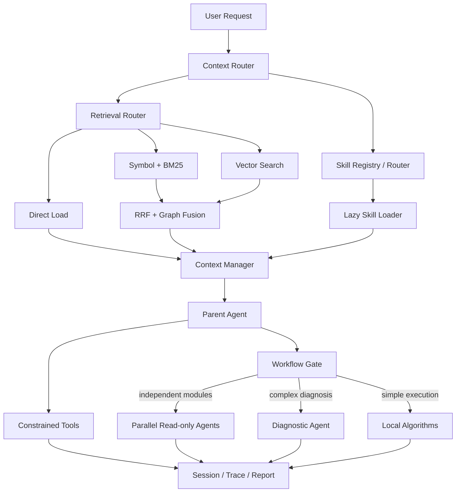

# Bingo

> 面向真实代码仓库的本地 Coding Agent：自适应代码检索、Symbol Graph、按需 Skill 与有门控的多 Agent Workflow。

[](https://www.python.org/)


Bingo 是一个直接运行在代码仓库中的本地智能 Agent。它能够读取和修改文件、执行受约束的命令、恢复会话，并根据仓库规模、查询类型和上下文预算，在直接加载、Symbol、BM25、向量与混合检索之间选择策略。

项目关注的不只是“让模型调用工具”，还包括检索质量、上下文成本、执行边界和可复现评测：源码位置与向量语义分离，Skill 按需加载，子 Agent 只在并行调查或复杂诊断确实有收益时启动，所有关键过程均可通过 Session、Trace 和 Report 回溯。

## 为什么做 Bingo

常见 Coding Agent 原型容易遇到几个问题：

- 小仓库也强制建立向量库，增加不必要的延迟；
- 直接 embedding 大段代码正文，函数细节稀释了向量语义；
- 文件摘要、历史记忆和当前检索结果混在一起，重复占用上下文；
- 每个步骤都启动子 Agent，调用成本和上下文反而继续增长；
- 只展示成功案例，没有固定数据集、失败分类和可复现报告。

Bingo 将这些问题拆成可测试的工程模块，并在 Runtime 中组合成一条自适应执行链路。

## 核心能力

### 1. 自适应代码检索

检索路由综合仓库规模、查询类型、路径线索、证据质量与上下文预算，按需选择：

| 场景 | 首选策略 | 升级条件 |
|---|---|---|
| 小仓库或明确文件 | 直接加载 | 内容超预算时转为检索 |
| 精确类名、函数名、错误符号 | Symbol + BM25 | 证据不足时增加向量召回 |
| 自然语言、中文跨语言查询 | Vector / Hybrid | 低置信度时融合关键词和图关系 |
| 大仓库 | Hybrid + 可选 HNSW | 通过候选上限和证据门控控制成本 |

仓库规模默认按 Chunk 数划分：小仓库 `≤ 200`，中仓库 `201～5000`，大仓库 `> 5000`。

### 2. AST Symbol Index 与短卡向量

Bingo 使用 Python AST 提取类、函数、方法、签名、父子关系、调用关系和精确源码位置，形成有界 Symbol Graph。向量库只保存短小的 `identity/behavior` 语义卡，不 embedding 完整方法正文、密钥、哈希和行号。

检索先返回“读什么、在哪里、为什么相关”，模型需要正文时再通过 `read_symbol` 校验文件哈希并读取原始代码。这种两阶段方式减少了长正文对向量匹配的干扰，也避免把未经选择的代码全部塞进 Prompt。

### 3. 分层上下文与记忆

上下文管理器将信息拆分为不同职责：

- `memory`：可跨任务复用的项目约定、决策和稳定事实；
- `retrieval_candidates`：本轮检索得到的位置候选；
- `source_evidence`：已经读取并经过哈希校验的源码证据；
- `transcript`：当前任务必要的交互历史；
- `skills`：本轮真正激活的 Skill 正文与资源。

默认使用 48,000 字符的分区预算，按完整证据块装配；读取缓存通过 SHA-256 检测文件变化并执行 LRU 淘汰，避免旧摘要或过期源码污染上下文。

### 4. Skill 路由与延迟加载

项目 Skill 放在 `.bingo/skills/<name>/SKILL.md`：

```text
.bingo/skills/
├── testing/
│   ├── SKILL.md
│   ├── references/
│   └── templates/
├── code-review/
│   ├── SKILL.md
│   └── checklists/
└── multi-agent-workflow/
    ├── SKILL.md
    └── references/
```

启动时只扫描名称、描述、alias 和触发条件。用户显式指定或路由器确认相关后才加载正文，references、templates 和 checklists 在执行过程中继续按需读取。没有合适 Skill 时，Agent 保持通用流程，不会为了“命中一个技能”而强行选择。

### 5. 有门控的多 Agent Workflow

Bingo 坚持以下调度顺序：

1. 普通检索、编辑与决策由父 Agent 完成；
2. 测试执行和结构化错误提取优先使用本地算法；
3. 只有 2～4 个互不依赖的跨模块调查才并发启动只读子 Agent；
4. 只有多失败、跨模块或非结构化错误通过诊断门控后，才启动串行诊断 Agent；
5. 子 Agent 的完整日志无损落盘，父 Agent 默认只接收 4,000 字符以内的结构化报告和来源位置。

这样既能在独立任务上获得并发收益，也能把大量推理过程和诊断日志隔离在主上下文之外。

### 6. 可控执行与恢复

- 工作区路径隔离和符号链接逃逸检查；
- `ask / auto / never` 三种危险工具审批策略；
- 子 Agent 工具白名单只能收窄权限；
- 敏感环境变量在 Trace 和 Report 中统一脱敏；
- Session、Checkpoint、Trace、Report 持久化；
- 重复工具调用检测、步骤预算和失败降级。

## 系统架构



## 快速开始

需要 Python 3.10 或更高版本。

```bash
git clone https://github.com/SHZU-Zyb/bingo.git
cd bingo
python -m venv .venv
```

Windows PowerShell：

```powershell
.\.venv\Scripts\Activate.ps1
pip install -e .
Copy-Item .env.example .env
```

macOS / Linux：

```bash
source .venv/bin/activate
pip install -e .
cp .env.example .env
```

如果需要本地向量模型和 HNSW：

```bash
pip install -e ".[rag,ann]"
```

在 `.env` 中填写你实际使用的模型配置，然后启动：

```bash
bingo --provider deepseek --auto-retrieve
```

也可以使用模块入口：

```bash
python -m bingo --provider ollama --model qwen3.5:4b
```

## 使用示例

交互模式：

```bash
bingo --cwd /path/to/repository --provider openai --auto-retrieve
```

一次性任务：

```bash
bingo --cwd /path/to/repository --provider deepseek \
  "定位登录状态失效的原因，修改代码并运行相关测试"
```

继续最近一次会话：

```bash
bingo --cwd /path/to/repository --resume latest
```

单独执行代码检索：

```bash
bingo-retrieve "where is checkpoint freshness validated"
```

常用 REPL 命令：

| 命令 | 作用 |
|---|---|
| `/help` | 查看内置命令 |
| `/memory` | 查看可召回记忆和最近文件引用 |
| `/session` | 查看当前 Session 文件位置 |
| `/reset` | 清空当前会话状态 |
| `/exit` | 退出 REPL |

## 模型与向量后端

生成模型支持：

| Provider | CLI 参数 | 主要配置 |
|---|---|---|
| Ollama | `--provider ollama` | `--host`、`--model` |
| OpenAI-compatible | `--provider openai` | `BINGO_OPENAI_API_BASE/KEY/MODEL` |
| Anthropic-compatible | `--provider anthropic` | `BINGO_ANTHROPIC_API_BASE/KEY/MODEL` |
| DeepSeek | `--provider deepseek` | `BINGO_DEEPSEEK_API_BASE/KEY/MODEL` |

代码向量后端与生成模型分开配置：

```bash
BINGO_EMBED_PROVIDER=fastembed
BINGO_EMBED_MODEL=sentence-transformers/paraphrase-multilingual-MiniLM-L12-v2
```

`fastembed` 在本地运行。也可以配置 Ollama 或 OpenAI-compatible embedding 服务；只有显式配置远程 Provider 时，检索文本才会发送到对应服务。

## 可复现验证

### 自动化测试

项目虚拟环境中的完整测试结果：

```text
218 passed, 2 skipped, 0 failed
```

其中真实仓库评测专项测试为 `6 passed`，Evaluator/Retrieval 相关回归为 `32 passed, 2 skipped`。

### 真实代码检索消融

当前固定快照包含 1 个真实仓库、55 个源文件、约 16.9 K LoC、854 个 Symbol、1,708 张短向量卡和 12 条人工标注查询，向量覆盖率为 100%。

| 策略 | Recall@5 | MRR | P95 | 无答案准确率 |
|---|---:|---:|---:|---:|
| Vector | 0.909 | 0.576 | 358.56 ms | 1.000 |
| Hybrid | 0.909 | 0.544 | 387.69 ms | 1.000 |
| Auto | 0.727 | 0.526 | 384.09 ms | 1.000 |

这组小样本中，Hybrid 的 Recall@5 与 Vector 持平，MRR 下降 5.53%，P95 上升 8.12%。项目保留了这个负向结果，用于继续调整融合权重、路由阈值与重排策略，而不是只展示更好看的合成数据。

脚本化 E2E 冒烟任务为 `2/2` 通过，平均 2 个模型轮次、1.05 秒；该结果只证明评测链路、隔离副本和确定性 Verifier 能够运行，不代表真实 LLM 的任务完成率。

运行评测：

```bash
# 仓库规模与 revision
bingo-benchmark inventory

# 本地 FastEmbed 检索消融
bingo-benchmark retrieval --latency-repetitions 5

# 只验证 E2E Harness，不作为模型成绩
bingo-benchmark e2e --provider scripted

# 使用已配置的真实模型重复执行
bingo-benchmark e2e --provider deepseek --repetitions 3
```

完整口径见 [真实仓库评测框架](docs/real-benchmark.md) 和 [验证报告](docs/metrics/real-repository-validation.md)。

## 项目结构

```text
bingo/
├── runtime.py              # Agent 主循环、会话与执行边界
├── context_manager.py      # 分区预算和 Prompt 装配
├── context_router.py       # 记忆、检索和上下文路由
├── retrieval.py            # 自适应检索与融合
├── retrieval_corpus.py     # AST、Symbol Graph 和索引构建
├── skill_registry.py       # Skill 元数据发现
├── skill_router.py         # 显式、相关性与模型路由
├── skill_loader.py         # 正文和资源延迟加载
├── workflow_engine.py      # 并行/串行 Workflow
├── verification_parser.py  # 本地测试结果提取
└── real_benchmark.py       # 真实仓库 E2E 与检索评测
```

## 安全与隐私

- 仓库只包含空值和占位符形式的 `.env.example`；真实 `.env` 被 Git 忽略；
- `.pem`、`.key`、credential/secret JSON、运行 Trace、Session 和向量索引默认不提交；
- 配置的 Secret 环境变量会在终端进度、Trace 和 Report 中脱敏；
- Shell 与写文件等工具受审批策略、工作区边界和超时限制；
- 使用云端生成模型时，选中的 Prompt 和源码证据会发送给对应 Provider，请根据代码保密要求选择本地 Ollama 或远程服务。

发现安全问题时请阅读 [Security Policy](SECURITY.md)，不要在公开 Issue 中粘贴凭据或未修复漏洞。

## 开发

```bash
pip install -e ".[rag,ann]"
pip install pytest ruff
pytest -q
```

更详细的设计与面试材料：

- [自适应检索、Symbol Graph 与上下文预算](docs/retrieval.md)
- [Skill 路由与按需加载](docs/skills.md)
- [有门控的多 Agent Workflow](docs/workflows.md)
- [真实仓库评测方法](docs/real-benchmark.md)
- [项目简历说明](docs/resume-project-description.md)

## 当前状态

Bingo 目前是 `0.1.0` 实验版本。检索、Skill、Workflow、会话恢复和评测链路已经具备完整测试，但真实模型 E2E 样本量仍不足以形成生产级结论。下一阶段重点是扩充多语言仓库数据集、校准 Auto Router，并验证 Hybrid reranker 在更多真实查询上的收益。
