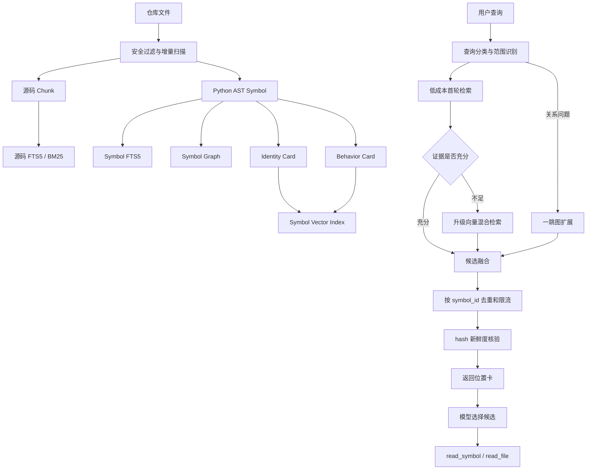

# Bingo 自适应代码检索与 Symbol RAG

本文说明 Bingo 的代码检索系统如何在直接读取、关键词检索、Symbol 检索、向量检索和 Symbol Graph 之间动态选择策略。内容同时面向项目维护者和面试讲解，所有阈值、字段与测试结果均对应当前实现。

关联文件：

- `bingo/retrieval_corpus.py`：仓库扫描、源码 Chunk、AST Symbol、FTS5、Symbol Graph 和 SQLite 持久化。
- `bingo/retrieval.py`：查询分类、自适应路由、短卡向量、RRF 融合、去重、预算与源码读取。
- `bingo/embeddings.py`：FastEmbed、Ollama、OpenAI 兼容 embedding 适配器。
- `bingo/tools.py`：面向模型的 `retrieve_code` 和 `read_symbol` 工具。
- `bingo/context_manager.py`：自动检索区域和上下文预算。
- `bingo/retrieval_cli.py`：独立建库和检索命令。
- `tests/test_retrieval.py`、`tests/test_symbol_retrieval.py`：检索回归测试。
- `scripts/benchmark_retrieval.py`：可复现的检索消融实验。

---

## 1. 项目要解决的问题

普通代码搜索一般有三个极端：

1. 全仓库直接塞进上下文。小项目简单有效，但仓库变大后上下文成本迅速增加。
2. 只做关键词匹配。查函数名、报错和配置项很准确，但无法处理“哪里负责恢复会话”一类语义查询。
3. 所有查询都走向量 RAG。看起来技术丰富，但函数名查询也要付出 embedding 和 ANN 成本，而且向量相似不代表代码关系可靠。

Bingo 的目标不是“给代码加一个向量库”，而是实现一个成本受控的自适应检索器：

> 根据查询类型、仓库规模、路径范围、上下文预算、向量覆盖率和首轮证据质量，选择当前最便宜且足够可靠的检索策略；只有证据不足时才升级。

这个目标可以拆成四个工程问题：

- 如何同时支持精确名称、源码关键词和自然语言语义？
- 如何让向量索引保存语义，而不被超长代码正文稀释？
- 如何表达类、方法、调用和继承关系？
- 如何保证返回的位置没有因为文件变化而失效？

---

## 2. 总体架构



系统采用两阶段读取：

1. `retrieve_code` 只返回短候选卡，包括路径、行号、Symbol ID、签名和用途。
2. 模型判断哪些候选值得展开，再调用 `read_symbol` 或 `read_file` 获取原文。

这样做把“召回”和“读取正文”分开。向量负责找到可能相关的位置，生成模型负责根据候选信息决定读取范围。

---

## 3. 为什么不 embedding 完整代码正文

完整代码正文包含大量影响语义匹配的噪声：

- 变量名、循环细节和通用异常处理会占用向量表达空间。
- 长方法会被截断，截断位置可能刚好丢失核心逻辑。
- 两个功能不同的方法可能共享大量框架模板。
- 行号、hash、时间戳等字段会变化，但不代表语义变化。
- 密钥、连接串和普通业务字面量不应因为建库进入远端 embedding 服务。

Bingo 因此只 embedding 两张短 Symbol Card。

### 3.1 Identity Card

Identity Card 表达“它是谁”：

```text
kind: method
qualified_name: SessionStore.latest
parent: SessionStore
signature: latest(self)
module: bingo.session_store
```

字段包括：

- `kind`
- `qualified_name`
- `parent`
- `signature`
- `module`

它适合匹配类名、方法名、模块名和接口形态。

### 3.2 Behavior Card

Behavior Card 表达“它大概做什么”：

```text
qualified_name: SessionStore.latest
purpose: Return the latest session file.
calls: self.root.glob, max
attributes: self.root, self.root.glob
literals: *.json
returns: return max
```

字段包括：

- 限定名
- docstring 第一段
- 直接调用名称
- 属性访问
- 少量具有路径或协议意义的调用参数
- 返回表达式的粗粒度特征

Behavior Card 来自确定性的 AST 解析，不调用生成模型编写摘要，因此不会把模型幻觉固化进索引。

### 3.3 字段上限

| 字段 | 当前上限 |
|---|---:|
| signature | 160 字符 |
| docstring | 240 字符 |
| calls | 12 个 |
| attributes | 10 个 |
| semantic literals | 6 个 |
| return hints | 4 个 |
| 单张 Card | 1200 字符 |

不会进入 embedding 的内容：

- 完整函数或方法正文
- `symbol_id`
- 文件 hash
- 起止行号
- 文件修改时间
- 全部子节点列表
- 普通字符串赋值
- 名称包含 `secret/password/token/api-key/credential` 的可疑字面量

需要说明的是，规则无法证明任意源码不含敏感信息。使用远程 OpenAI 兼容服务或远程 Ollama 时，短 Card 仍会发送给目标服务。敏感仓库应优先使用本地 FastEmbed，并通过 `.bingoignore` 排除不应索引的目录。

---

## 4. 仓库扫描与安全边界

`repository_files()` 逐目录扫描，不会一次把全仓正文加载到一个大字符串中。

### 4.1 支持的文件

当前覆盖 Python、JavaScript、TypeScript、Java、Go、Rust、C/C++、C#、Ruby、PHP、Swift、Kotlin、Markdown、RST、TXT、TOML、YAML、JSON、SQL、Shell、PowerShell 和 Vue 等文本格式。

Python 文件获得 AST Symbol 能力。其他语言目前保留源码 Chunk、FTS5 和路径定位能力，但不会制造不可靠的伪 AST Symbol。

### 4.2 排除规则

默认排除：

- `.git`、`.bingo`
- `.venv`、`venv`、`node_modules`
- `__pycache__`、pytest/ruff 缓存
- `dist`、`build`、`coverage`、`vendor`、`tmp`
- `.env*`
- `credentials.json`、`secrets.json`
- `*.lock`、`*.min.js`
- 超过 512 KiB 的文件
- 含 NUL 字节的二进制文件
- UTF-8 解码失败的文件
- 符号链接、Windows junction 和其他 reparse point

项目可以使用嵌套 `.gitignore` 和 `.bingoignore`。扫描器通过 `pathspec` 应用 GitIgnore 语义，包括子目录规则和否定规则。

所有路径在读取和返回前都必须满足：

```text
resolved_path is_relative_to workspace_root
```

指定 `path` 是硬范围条件。Symbol、关键词、向量和图检索都不能越过该范围。

---

## 5. 源码 Chunk 索引

源码正文仍然有价值，但它只用于本地 FTS5/BM25，不用于 embedding。

Python Chunk 首先按顶层 AST 节点切分，并把装饰器纳入定义起始行。过长节点再按以下边界切片：

- 最多 40 行
- 最多 1600 字符
- 相邻窗口保留 3 行重叠

非 Python 文件直接使用相同的有界行窗口。超过上限的单个超长行不会作为代码上下文写入索引。

FTS 文本包含路径、顶层 Symbol 名和源码正文。分词器会：

- 保留完整标识符
- 拆分 `snake_case`
- 拆分 `camelCase`
- 小写化英文
- 对连续中文生成 bigram

例如：

```text
restoreCheckpoint → restorecheckpoint, restore, checkpoint
session_store     → session_store, session, store
恢复会话           → 恢复, 复会, 会话
```

因此报错文本、配置键、URL、常量和源码片段仍然适合走关键词通道。

---

## 6. AST Symbol 索引

### 6.1 Symbol 粒度

当前 Python 解析以下节点：

- `class`
- 顶层 `function`
- 顶层 `async function`
- `method`
- `async method`
- `nested function`

同名 Symbol 通过稳定 ID 区分：

```text
symbol_id = sha256(path + "\0" + qualified_name + "\0" + kind)
```

行号不参与 ID。仅在方法上方增加几行代码时，Symbol ID 不会变化；路径、限定名或类型变化时，ID 会变化。

### 6.2 Symbol 元数据

`symbols` 表保存：

| 字段 | 作用 |
|---|---|
| `symbol_id` | 稳定主键 |
| `path` | 来源文件 |
| `qualified_name` | 如 `SessionStore.latest` |
| `simple_name` | 如 `latest` |
| `kind` | class/function/method/nested_function |
| `parent_qualified_name` | 父类或父函数 |
| `signature` | 受限长度的签名 |
| `docstring` | 清洗、截断后的说明 |
| `start_line/end_line` | 精确源码范围 |
| `content_hash` | 文件新鲜度依据 |
| `calls` | 直接调用名称 |
| `attributes` | 属性访问 |
| `literals` | 少量语义字面量 |
| `returns_hint` | 返回行为提示 |
| `bases` | 基类名称 |
| `card_schema` | 当前为 `symbol-card-v1` |

如果 Python 文件语法错误，系统不会凭文本猜测函数边界。它会记录 `parse_error`，保留 Chunk/BM25 降级能力，并把 `parse_failures` 暴露在索引统计中。

---

## 7. Symbol Graph

### 7.1 当前关系类型

| 关系 | 示例 | 置信度 |
|---|---|---:|
| `contains` | `SessionStore` 包含 `SessionStore.latest` | 1.0 |
| `inherits` | `SessionStore` 继承 `BaseStore` | 1.0 |
| `calls` | `login_user` 调用 `authenticate_user` | 0.9 |

### 7.2 关系解析原则

图中只保存可以静态、唯一解析的目标：

1. `self.method()` 和 `cls.method()` 优先在当前父类下解析。
2. 完整限定名优先精确解析。
3. 简单名称只有在全仓唯一时才建立跨文件边。
4. 同名候选不唯一时不猜测。

因此反射、猴子补丁、运行时注入、复杂动态分派和字符串导入不会被表示成确定调用关系。

这种设计牺牲一部分图召回率，换取图关系可解释。面试时可以把它概括为：

> Symbol Graph 中的边代表静态证据，不代表完整运行时调用图。

### 7.3 图扩展边界

关系查询只在首轮 Symbol 候选上扩展：

- 最多选择前 2 个种子 Symbol
- 默认只扩展 1 跳
- 每个种子默认最多 8 个邻居
- 可通过 `BINGO_RETRIEVAL_GRAPH_FANOUT` 设置 1～32
- 同一个邻居只加入一次
- 同时保留入边和出边方向，如 `in:calls`、`out:inherits`

这些限制防止公共工具函数把候选集合扩散到整个仓库。

---

## 8. SQLite 持久化结构

索引默认保存在：

```text
.bingo/retrieval/index.sqlite3
```

主要表：

```text
files
  path, hash, parse_error

chunks
  id, path, start_line, end_line, symbol, content_hash, content

lexical (FTS5)
  Chunk 关键词索引

symbols
  Symbol 身份、位置和 AST 元数据

symbol_lexical (FTS5)
  Symbol Card 关键词索引

symbol_edges
  source_symbol_id, target_symbol_id, relation, confidence

symbol_vectors
  symbol_id, card_kind, model, card_schema, card_hash, vector
```

旧版 `vectors` 表保存过完整 Chunk 向量。当前版本初始化数据库时会清空该表，避免旧正文向量继续占用磁盘或被误用。

### 8.1 增量更新

每次同步先比较文件 hash：

- hash 未变化：复用 Chunk、Symbol 和向量。
- hash 变化：在一个数据库事务内删除并重建该文件的 Chunk、Symbol、FTS 和边。
- 文件删除或重命名：通过外键级联删除旧数据。
- Card 内容变化：`card_hash` 不一致时只重建对应向量。
- embedding 模型身份变化：使旧 Symbol 向量失效。
- Card Schema 变化：使旧 Symbol 向量失效。

`symbol_vectors` 的主键是 `(symbol_id, card_kind)`，因此一个 Symbol 正常对应 identity 和 behavior 两条向量。

---

## 9. 自适应路由

支持的模式：

```text
auto / direct / symbol / keyword / hybrid / vector
```

`auto` 用于产品运行，其余模式主要用于调试、对照和消融实验。

### 9.1 查询分类

路由器先把查询分成五类：

| 类型 | 示例 | 识别方式 |
|---|---|---|
| `qualified_symbol` | `SessionStore.latest` | 限定标识符形式 |
| `identifier` | `authenticate_user` | 单个标识符 |
| `relationship` | `who calls pack_hits`、`谁调用 authenticate` | 调用/继承关系词 |
| `location` | `bingo/retrieval.py` | 路径或扩展名 |
| `semantic` | `哪里负责恢复最新会话` | 其他自然语言查询 |

### 9.2 路由决策表

| 条件 | 首轮策略 | 是否使用向量 |
|---|---|---|
| 明确文件或子目录，内容能放入预算 | `direct` | 否 |
| qualified/simple name 精确命中 | `symbol` | 否 |
| 标识符没有精确 Symbol | `keyword` | 否 |
| 关系查询 | `symbol + graph` | 默认否 |
| 自然语言 | `symbol + keyword` | 首轮不足才使用 |
| 用户强制 `hybrid` | 三路融合 | 是 |
| 用户强制 `vector` | 仅向量消融 | 是 |
| embedding 未配置或失败 | Symbol/关键词降级 | 否 |

### 9.3 小仓库也不会盲目全量加载

仓库按 Chunk 数划分：

| 层级 | 当前阈值 |
|---|---:|
| small | `chunks <= 200` |
| medium | `200 < chunks <= 5000` |
| large | `chunks > 5000` |

“small”只是路由条件之一。全仓自然语言查询不会因为仓库小就自动塞入全部文件。只有明确文件、明确子目录、概览类请求，并且完整内容能放入预算时，才使用 direct。

判断是否可以直接加载时，会累计文件正文、路径和定位头的 UTF-8 大小。只要超出 `min(budget_chars, budget_tokens)`，整个 direct 候选集合会放弃并降级关键词检索，不会返回半个仓库。

### 9.4 证据门控

自适应的核心不是“识别语义查询后立刻走向量”，而是判断廉价首轮结果是否足够。

对于标识符查询，只要 Symbol 精确命中即可认为首轮证据充分。

对于语义查询，当前门控要求：

1. 某个 Symbol 同时出现在 Symbol FTS 前 5 和源码 BM25 前 5；
2. 过滤常见停用词后，查询词至少有 50% 出现在该 Symbol 的短 Card 中。

两个不相关文件各命中一个普通词，不会被当成“证据充分”。门控失败时：

```text
strategy = hybrid
route_reason = weak_first_pass_escalation
escalated = true
```

这个阈值是可解释的工程启发式，不是统计意义上的置信概率。它需要随真实查询集持续校准。

---

## 10. 向量索引与 ANN

支持三种真实 embedding 后端：

| Provider | 接口 | 典型使用方式 |
|---|---|---|
| FastEmbed | 本地 ONNX | 默认推荐，源码不离开本机 |
| Ollama | `/api/embed` | 本地或自托管模型 |
| OpenAI compatible | `/embeddings` | OpenAI 或兼容服务 |

适配器验证：

- 返回向量数量必须与输入数量一致。
- 同一批向量维度必须一致。
- 向量不能包含 NaN/Infinity。
- 零向量被拒绝。
- 向量进入索引前执行 L2 归一化。
- 远端异常正文不会进入公开 fallback 信息。

模型身份包含 provider、模型名、运行库版本或服务地址指纹。服务地址只存 hash 指纹，不暴露完整 URL。

### 10.1 建库批次

- 默认每批 32 张 Card。
- 普通查询一次最多补齐 256 张缺失 Card。
- `index --require-vector` 可以完成全部缺失向量。
- `vector_coverage = 已有 Card 向量数 / (Symbol 数 × 2)`。

覆盖率不足时，系统会真实报告比例，不能把部分建库描述成完整 RAG。

### 10.2 精确扫描和 HNSW

- small/medium 或限定路径查询使用精确余弦扫描。
- large 且全仓查询优先构建进程内 USearch HNSW。
- HNSW 缺失、构建失败或不可用时回退精确扫描。
- ANN 无结果或最高相似度低于 `0.55` 时，再做一次精确扫描。
- 文档最低相似度默认 `0.25`。

HNSW 的 key 包含 Corpus generation、向量 revision、模型身份和向量数量。源码或向量发生变化后，进程内 ANN 会自动重建。

当前 HNSW 不跨进程持久化。SQLite 中的 Symbol 向量才是规范数据，HNSW 是可丢弃的派生索引。

---

## 11. 多路融合

不同通道的原始分数不可直接相加：BM25 越小越好，余弦相似度越大越好，Symbol 精确匹配又是离散信号。Bingo 使用加权 Reciprocal Rank Fusion（RRF）：

```text
score(symbol) += channel_weight / (60 + rank)
```

当前权重：

| 场景/通道 | 权重 |
|---|---:|
| 精确 Symbol 模式中的 symbol | 1.4 |
| keyword/hybrid 中的 symbol | 1.2 |
| keyword | 1.0 |
| vector | 0.9 |
| graph | 0.8 |
| direct | 1.0 |

融合前先统一主键：

- Symbol FTS 结果直接使用 `symbol_id`。
- 向量的 identity/behavior 两张 Card 归并为同一个 `symbol_id`。
- 源码 Chunk 映射到覆盖它且范围最小的 Symbol。
- 无法映射的文档或模块 Chunk 使用 `chunk:<id>`。

同一个 Symbol 在单个通道只计算一次排名，避免两张向量 Card 给同一节点重复加权。

限定名完全匹配会在最终排序中获得硬优先级。它不会被普通语义相似结果挤到后面。

---

## 12. 去重、限流与来源定位

融合后的候选还要经过三层处理。

### 12.1 新鲜度检查

每个候选返回前重新读取文件并计算 SHA-256。如果当前 hash 与索引保存的 `content_hash` 不一致，该候选会被丢弃并计入 `stale_candidates`。

### 12.2 正文去重

系统按候选行范围重新计算正文 hash，但不会把正文放进位置卡。相同实现出现在多个文件时，只保留一张候选卡，并把所有位置合并到 `sources`。

这解决了模板代码或复制文件占满 Top K 的问题。

### 12.3 候选多样性

非 direct 模式默认限制：

- 每个文件最多 4 个候选。
- 同一个父类或父节点最多 3 个候选。

这样一个大类的所有方法不会挤掉其他模块的结果。

最终 `sources` 至少包含：

```json
{
  "path": "bingo/retrieval_corpus.py",
  "start_line": 126,
  "end_line": 209,
  "qualified_name": "extract_symbols",
  "symbol_id": "...",
  "content_hash": "..."
}
```

---

## 13. 两阶段源码读取

### 13.1 retrieve_code

`retrieve_code` 的职责是返回候选位置：

```text
Retrieved code locations ...

[bingo/retrieval_corpus.py:211-231]
symbol_id=<stable id>
kind=function qualified_name=symbol_cards
signature=symbol_cards(symbol)
purpose=Create short embedding inputs...
```

首轮结果不会自动包含方法正文。位置卡更短，也让模型能够比较多个候选后再读取。

### 13.2 read_symbol

模型选中候选后调用：

```json
{
  "name": "read_symbol",
  "args": {
    "symbol_id": "<retrieve_code 返回的 ID>",
    "expected_hash": "<retrieve_code 返回的 hash>",
    "max_chars": 4000
  }
}
```

执行顺序：

1. 同步当前 Corpus。
2. 根据 Symbol ID 读取最新元数据。
3. 再次校验路径位于 workspace。
4. 读取当前文件并计算 hash。
5. 对比索引 hash 和可选 `expected_hash`。
6. 按 AST 起止行读取源码。
7. 如果过长，只按完整行截取，并提示使用 `read_file` 读取剩余范围。

引擎层 `max_chars` 范围为 256～32000；模型工具层限制为 256～4000，以符合工具输出预算。

如果文件在检索后发生变化，旧候选不会静默读取新位置，而是返回 `symbol location is stale`。

---

## 14. 上下文预算

### 14.1 信息源职责

自适应代码检索上线后，Memory 不再承担“仓库知识库”的职责。系统按数据来源和生命周期拆分为：

| 区域 | 内容 | 生命周期 | 事实优先级 |
|---|---|---|---:|
| Task State / Checkpoint | 目标、进度、阻塞、下一步、证据引用 | 当前任务 | 3 |
| Recalled Memory | 决策、约定、偏好、依赖事实、恢复经验 | 跨任务 | 2 |
| Retrieval Candidates | Symbol ID、路径、行号、签名、命中通道 | 当前检索 | 4 |
| Source Evidence | 当前文件中已经核验哈希的源码 | 当前模型调用 | 5 |
| Evidence Cache | 已读取源码、范围和文件哈希 | 会话内 LRU | 不直接判断 |
| Recent History | 最近对话和工具观察 | 会话窗口 | 3 |

优先级表达冲突处理：当前 Source Evidence 高于历史 Memory。Memory 只提供先验，不能覆盖当前源码。

旧实现中一次 `read_file` 会同时生成 `file_summaries` 和 episodic note，随后又可能在 Relevant Memory 和历史里重复出现。现在的新读取只进入 Evidence Cache；`file_summaries` 仅用于读取旧 Session、校验 freshness 和兼容历史压缩，不再进入 Memory Prompt，也不会成为 Memory 召回候选。

### 14.2 Context Router

`bingo/context_router.py` 负责选择信息源：

| 查询 | Memory 召回 | 代码检索 | Evidence Cache |
|---|---:|---:|---:|
| “我们之前为什么决定使用短卡” | 是 | 否 | 否 |
| “`pack_hits` 在哪里定义” | 相关笔记命中时 | 是 | 是 |
| “按照之前的决定修改 `retrieval.py`” | 是 | 是 | 是 |
| “继续刚才的任务” | 相关笔记命中时 | 否 | 否 |
| 普通聊天 | 否 | 否 | 否 |

Memory 候选探测只检索非代码笔记，成本很低。代码意图只有在启用 `--auto-retrieve` 时才自动触发仓库检索；手动 `retrieve_code` 始终可用。路由结果通过 `context_route.intent`、`use_memory_recall`、`use_code_retrieval` 和 `reasons` 解释。

### 14.3 Evidence Cache

缓存条目保存在 Session 的 `evidence_cache.entries`，默认最多 8 条、每条最多 4000 字符，采用 LRU 淘汰。键由以下字段计算：

```text
path + start_line + end_line + file_hash + symbol_id
```

缓存只在以下条件全部满足时进入 Source Evidence：

1. 路径仍在 workspace 内。
2. 文件仍然存在。
3. 当前文件 SHA-256 与缓存一致。
4. 缓存范围完整覆盖检索候选范围。
5. Symbol ID 在双方都提供时一致。
6. 当前查询不是 direct 模式；direct 已携带正文，重复缓存会浪费预算。

`read_file` 和 `read_symbol` 成功后写入缓存，`write_file` 和 `patch_file` 会按路径立即失效缓存。外部编辑在下一次 Prompt 构建时通过文件哈希发现。Checkpoint 只保存 `evidence_refs`，不复制代码正文。

#### 14.3.1 同一任务内的行区间防重

只比较工具参数无法识别语义重复。例如，先读取 `1-120`，结果因 4000 字符上限只展示到第 78 行，随后再请求整文件或 `40-110`，参数虽然不同，仍会重复返回大量旧内容。

Bingo 在每次顶层请求开始时建立临时读取覆盖表，按 `path + file_hash + line ranges` 记录本任务已经真正展示给模型的行号。新的 `read_file` 请求会先做区间规划：

```text
已展示：1-78
请求：  1-120
实际读：79-120

已展示：1-120
请求：  40-110
结果：  拒绝，直接复用现有 Evidence
```

该机制有四个边界：

1. 只在同一个用户任务内阻止重复读取；新任务可以重新读取，避免旧任务证据没有进入当前 Prompt 时误拒绝。
2. 文件哈希变化后立即清空该路径的覆盖范围；`write_file`、`patch_file` 和外部编辑都不会复用旧代码。
3. 被 4000 字符截断的读取只记录实际出现的行号，不把请求但未返回的尾部误判为已读。
4. Trace 保留模型请求参数，同时记录 `effective_args`、`read_cache_action` 和 `skipped_cached_range`，可以审计模型想读什么以及系统实际读了什么。

这不是用摘要替代源码。首次读取仍返回原文，后续只跳过当前任务中已进入上下文的相同行区间。

#### 14.3.2 步骤预算收尾保护

默认 CLI 预算调整为每个请求 12 个工具步骤、每次模型输出 2048 tokens。每轮 Prompt 都包含一个可压缩的 `Run control` 区域，告诉模型已经使用和剩余的工具次数。当只剩两个工具额度时，运行时关闭 `list_files`、`search`、`retrieve_code`、`read_symbol` 和 `read_file` 等继续探索动作，引导模型使用已有证据进行编辑、验证或返回最终答案。写入与验证工具仍然可用，因此该保护不会把任务锁死在只读阶段。

`Run control` 位于当前请求之前；总上下文过小时优先删除该区域。用户原始请求仍保持完整并位于 Prompt 最后。

### 14.4 Prompt 顺序和字符预算

默认 Prompt 上限从 12000 字符调整为 48000 字符。各区域使用字符数，避免将项目绑定到某个模型 tokenizer：

```python
DEFAULT_TOTAL_BUDGET = 48000

DEFAULT_SECTION_BUDGETS = {
    "prefix": 6000,
    "memory": 1800,
    "relevant_memory": 1200,
    "retrieval": 2400,
    "source_evidence": 20000,
    "history": 7000,
    "run_control": 500,
}
```

其中 `relevant_memory` 是旧配置名，Prompt 中显示为 `Recalled memory`；`retrieval` 对应 `Retrieval Candidates`。保留旧名字是为了让已有 feature flag、测试配置和 Session 平滑迁移。

最终顺序为：

```text
Prefix + Checkpoint
Working State（最近文件引用和可召回记忆计数）
Recalled Memory（有命中才出现）
Retrieval Candidates（代码查询才出现）
Source Evidence（存在新鲜缓存命中才出现）
Recent History
Run Control（已用/剩余步骤与收尾约束）
Current Request
```

超预算时先删除可重新生成的 Run Control，再依次压缩 Recalled Memory、候选、历史、Source Evidence、Working Memory 和 Prefix。当前请求永不裁剪；候选和 Source Evidence 都按整块装配。若同一读取已经作为 Source Evidence 注入，历史中的对应 `read_file`/`read_symbol` 结果会被删除。

### 14.5 检索工具自身预算

检索同时接收：

- `budget_chars`
- `budget_tokens`
- `top_k`

当前项目没有绑定具体生成模型 tokenizer。`budget_tokens` 使用 UTF-8 字节数作为保守上界，因此中文会比真实 token 估计更保守。结果元数据明确记录：

```text
token_estimate_method = utf8_bytes_upper_bound
```

位置卡和 direct 正文都采用整块装配：当前块放不下就舍弃，不会从中间截断定位头。

工具层 `retrieve_code` 最多输出 4000 字符。启用 `--auto-retrieve` 后，ContextManager 为自动候选预留 2400 字符，并允许新鲜缓存源码使用最多 20000 字符；总 Prompt 超限时会重新按完整卡片或完整证据块压缩。

Checkpoint 被放在 prefix 最前端，避免工具目录增长后恢复目标、阻塞点和下一步被尾部裁剪。

---

## 15. 失败与降级策略

| 失败情况 | 行为 | 可观察字段 |
|---|---|---|
| 未配置 embedding | 回退 Symbol/关键词 | `embedding_not_configured` |
| provider 请求或响应失败 | 回退 Symbol/关键词 | `embedding_unavailable` |
| 同模型向量维度变化 | 拒绝混用并回退 | `embedding_unavailable` |
| USearch 未安装 | 精确余弦扫描 | `ann_not_installed` |
| ANN 运行失败 | 精确余弦扫描 | `ann_unavailable` |
| ANN 最高相似度太低 | 精确余弦扫描 | `ann_low_similarity` |
| Python AST 解析失败 | 保留 Chunk/BM25 | `parse_failures` |
| 文件检索后变化 | 丢弃候选 | `stale_candidates` |
| read_symbol hash 变化 | 拒绝读取 | stale 错误 |
| direct 超预算 | 转关键词 | `direct_scope_exceeds_budget` |
| 所有通道无有效候选 | 返回空证据 | `hits=[]` |
| Evidence Cache 文件变化 | 删除缓存，不注入源码 | `stale_evidence_invalidations` |
| 缓存只覆盖部分 Symbol | 不作为完整证据注入 | `source_evidence.cache_hits=0` |

异常信息不会包含远端响应正文或 API key。降级后的 `strategy` 表示实际执行策略，而 `requested_mode` 保留用户原始要求。

---

## 16. 可观察性

一次检索返回的关键 trace：

```json
{
  "requested_mode": "auto",
  "strategy": "hybrid",
  "route_reason": "weak_first_pass_escalation",
  "query_type": "semantic",
  "escalated": true,
  "evidence_sufficient": false,
  "corpus_tier": "medium",
  "channels_used": ["symbol", "keyword", "vector"],
  "vector_coverage": 1.0,
  "vector_backend": "exact_cosine",
  "graph_depth": 0,
  "candidate_count": 23,
  "stale_candidates": 0,
  "estimated_tokens": 1380,
  "duration_ms": 18.4
}
```

Context 组装还会记录：

```json
{
  "context_route": {
    "intent": "mixed",
    "use_memory_recall": true,
    "use_code_retrieval": true,
    "use_evidence_cache": true,
    "reasons": ["code_intent", "memory_intent", "memory_candidate_match"]
  },
  "retrieval_candidates": {
    "rendered_chars": 428,
    "rendered_sources": []
  },
  "source_evidence": {
    "cache_hits": 1,
    "rendered_chars": 1247,
    "stale_invalidations": 0
  },
  "history": {
    "deduped_source_evidence_count": 1
  }
}
```

这些字段用于回答三个问题：

1. 为什么选择这个策略？
2. 实际用了哪些召回通道，是否发生降级？
3. 为这些证据支付了多少时间和上下文成本？

向量相似度只参与排序，不会被包装成“答案置信度”。

---

## 17. 安装与运行

以下命令均在项目根目录执行。

### 17.1 安装基础项目

```powershell
.\.venv\Scripts\python.exe -m pip install -e .
```

安装本地 RAG 和 ANN 可选依赖：

```powershell
.\.venv\Scripts\python.exe -m pip install -e ".[rag,ann]"
```

离线环境已经具备构建依赖时，可以避免 pip 创建隔离环境后尝试联网：

```powershell
.\.venv\Scripts\python.exe -m pip install -e . --no-deps --no-build-isolation
```

### 17.2 配置本地 embedding

`.env`：

```dotenv
BINGO_EMBED_PROVIDER=fastembed
BINGO_EMBED_MODEL=sentence-transformers/paraphrase-multilingual-MiniLM-L12-v2
BINGO_RETRIEVAL_USE_ANN=1
BINGO_RETRIEVAL_ANN_MIN_SIMILARITY=0.55
BINGO_RETRIEVAL_MAX_EMBED_CHUNKS=256
BINGO_RETRIEVAL_SMALL_CHUNKS=200
BINGO_RETRIEVAL_LARGE_CHUNKS=5000
BINGO_RETRIEVAL_GRAPH_FANOUT=8
```

环境变量名保留了 `MAX_EMBED_CHUNKS`，但当前限制对象已经是 Symbol Card。这是为了兼容已有配置。

### 17.3 建立完整索引

```powershell
.\.venv\Scripts\python.exe -m bingo.retrieval_cli index --require-vector
```

`--require-vector` 会在 embedding 不可用或覆盖率不足 100% 时返回非零状态，适合 CI 或演示前检查。

### 17.4 自适应查询

```powershell
.\.venv\Scripts\python.exe -m bingo.retrieval_cli search "哪里负责解析 AST 并生成 Symbol Card" --json
```

### 17.5 强制模式对照

```powershell
.\.venv\Scripts\python.exe -m bingo.retrieval_cli search "restore_checkpoint" --mode symbol --json
.\.venv\Scripts\python.exe -m bingo.retrieval_cli search "清理过期缓存" --mode keyword --json
.\.venv\Scripts\python.exe -m bingo.retrieval_cli search "恢复会话" --mode vector --json
.\.venv\Scripts\python.exe -m bingo.retrieval_cli search "恢复会话" --mode hybrid --json
```

### 17.6 启用 Agent 自动检索

```powershell
.\.venv\Scripts\python.exe -m bingo --auto-retrieve --provider deepseek
```

不启用自动检索时，模型仍然可以主动调用 `retrieve_code`。

---

## 18. 测试设计

### 18.1 Symbol 与 AST

测试覆盖：

- class/function/method/nested function 多粒度提取
- 装饰器起始行
- 稳定 Symbol ID
- 签名、父节点和限定名
- 同文件 `contains/inherits/calls`
- 全仓唯一名称的跨文件 calls
- AST 失败后的 Chunk 降级
- parse failure 在重复同步后仍可观察

### 18.2 Embedding

测试通过可控 FixtureEncoder 捕获真实输入，验证：

- embedding 输入包含 identity/behavior 字段
- 完整方法正文不进入 embedding
- `super-secret-value` 一类普通秘密赋值不进入 Card
- hash、Symbol ID 和行号不进入 Card
- Card 长度受限
- 模型身份变化会重建向量
- 同模型维度变化会被拒绝
- 不完整建库正确报告覆盖率
- provider 失败会降级且不泄漏远端异常正文

### 18.3 路由与融合

测试覆盖：

- 明确路径 direct
- exact symbol 路由
- semantic hybrid 路由
- 两个不相关 token 命中不会误判为强证据
- Symbol、关键词和向量按同一个 ID 融合
- 重复正文合并全部 sources
- 单文件和父节点候选上限
- 无答案关键词查询返回空结果
- 关系查询的一跳 graph 扩展
- 大仓库 ANN 和低相似度精确回退

### 18.4 安全与新鲜度

测试覆盖：

- `.gitignore` 与子目录否定规则
- `.env`、私密目录排除
- workspace 路径逃逸拒绝
- Windows junction 不进入 embedding
- embedding 期间文件变化后候选失效
- `read_symbol` expected hash 校验
- 长 Symbol 按完整行截断

### 18.5 Runtime 集成

测试覆盖：

- `retrieve_code` 工具注册和元数据
- `read_symbol` 工具展开精确源码
- 自动检索进入 prompt
- 位置卡在历史压缩中保持紧凑
- 检索块遵守上下文预算
- checkpoint 不因工具目录增长而被裁掉

---

## 19. 当前验证结果

验证日期：2026-09-08。

### 19.1 完整回归测试

```text
156 passed, 1 skipped in 127.23s
```

跳过项是原有 Windows 特权符号链接测试；不需要特权的 NTFS junction 回归测试已经通过。

### 19.2 静态与打包检查

- 检索模块、工具注册、benchmark 和检索测试通过 Ruff。
- `python -m compileall -q bingo` 通过。
- 核心模块导入通过。
- editable wheel 构建与安装通过。
- `pip check` 输出 `No broken requirements found`。
- CLI `index/search` 和引擎 `read_symbol` 烟测通过。

仓库其他历史模块仍有既存 Ruff backlog，本次没有把无关的全仓格式清理混入检索功能修改。

### 19.3 当前仓库真实索引

```json
{
  "files": 48,
  "chunks": 954,
  "symbols": 209,
  "parse_failures": 0,
  "vectors": 418,
  "vector_coverage": 1.0,
  "fallback_reason": ""
}
```

数据库检查：

```json
{
  "legacy_body_vectors": 0,
  "symbol_vectors": 418,
  "symbol_edges": 405
}
```

这证明当前索引只保留两张 Symbol Card 向量，没有继续使用旧版正文向量。

### 19.4 真实查询烟测

查询：

```text
找出负责解析 AST 并生成短向量卡的代码
```

路由结果：

```json
{
  "strategy": "hybrid",
  "route_reason": "weak_first_pass_escalation",
  "query_type": "semantic",
  "escalated": true,
  "channels_used": ["symbol", "keyword", "vector"],
  "vector_coverage": 1.0
}
```

前三个候选：

1. `_BehaviorVisitor`
2. `_call_name`
3. `extract_symbols`

三者都位于 `bingo/retrieval_corpus.py`。随后精确检索 `symbol_cards` 并调用 `read_symbol`，成功读取 1247 字符定义，`truncated=false`。

关系查询：

```text
who calls pack_hits
```

实际使用 `symbol + graph`，深度为 1，找到了 `ContextManager._render_sections` 和 `ContextManager._render_history_item` 等调用者，并返回 `in:calls` 方向信息。

### 19.5 小型可复现 benchmark

数据集包含 4 个目标函数和 8 条查询，覆盖：

- 精确 Symbol
- 英文语义
- 中文跨语言语义
- 调用关系
- 无答案问题

结果：

| Mode | Recall@5 | MRR | Observed P95 |
|---|---:|---:|---:|
| symbol | 0.714 | 0.643 | 13.81 ms |
| keyword | 0.714 | 0.643 | 10.65 ms |
| vector | 1.000 | 1.000 | 55.17 ms |
| hybrid | 1.000 | 1.000 | 12.35 ms |
| auto | 1.000 | 1.000 | 12.31 ms |

运行命令：

```powershell
.\.venv\Scripts\python.exe scripts\benchmark_retrieval.py `
  --require-vector `
  --output artifacts\retrieval-symbol-small.json
```

这些数字只证明当前小型合成任务链路可运行。不同 mode 在同一进程顺序执行，后面的查询可能受 query embedding 缓存影响，因此 P95 不能用于严格性能对比，也不能外推成真实大型仓库准确率。

---

## 20. 如何解释 benchmark 指标

### Recall@5

期望文件是否出现在前 5 个候选来源中。它衡量“相关证据有没有被召回”，不衡量最终回答是否正确。

### MRR

第一个相关结果排名的倒数：

```text
第 1 名命中 → 1.0
第 2 名命中 → 0.5
第 5 名命中 → 0.2
没有命中   → 0
```

### P95

95% 查询延迟不超过该值。当前样本只有 8 条，且存在缓存，所以它只能作为烟测数据。

### 正确拒答

无答案查询应该返回空候选，而不是强行凑满 Top K。当前关键词通道可以自然拒答；纯向量通道仍依赖模型相关的相似度阈值，需要更多负样本校准。

---

## 21. 面试讲解

### 21.1 30 秒版本

> 我给本地 coding agent 做了一套自适应代码检索。它先根据仓库规模、查询类型、路径范围和上下文预算，选择直接读取、Symbol 或 BM25；自然语言首轮证据不足时才升级向量检索。Python 代码通过 AST 建立类、函数、方法和调用关系，每个 Symbol 只 embedding 两张受限长度的 identity/behavior Card，不 embedding 正文。召回结果通过加权 RRF 按 Symbol ID 融合，先返回位置，再由模型调用 read_symbol 读取经过 hash 校验的源码。

### 21.2 2 分钟版本

> 这个功能最初只有字段和关键词匹配。我没有直接改成所有请求都走 RAG，因为函数名查询用向量既慢又可能降低精度，小仓库也没有必要先建 ANN。
>
> 我的设计分成索引和查询两部分。索引侧保留源码 BM25，同时用 Python AST 提取 class、function、method 和 nested function，保存限定名、签名、docstring、calls、attributes、return hints，并建立 contains、inherits 和静态可唯一解析的 calls 图。向量不存完整代码，而是每个 Symbol 两张短卡：identity 表达它是谁，behavior 表达它做什么。这样既控制长度，也减少模板代码对向量语义的稀释。
>
> 查询侧先分类。路径请求直接读，精确名称走 Symbol，自然语言先做 Symbol FTS 和源码 BM25。只有两个通道没有在同一 Symbol 上形成足够覆盖时才升级 vector。关系问题则做最多一跳、fan-out 有上限的图扩展。各通道不能直接比较原始分数，所以我用 weighted RRF，并在融合前把 Chunk 和两张向量卡统一到 symbol_id。
>
> 最后系统只返回短位置卡，模型选择后再 read_symbol。读取前会再次比较文件 hash，避免使用已经漂移的行号。完整测试是 156 passed、1 skipped；当前仓库建立了 209 个 Symbol、418 张向量卡，覆盖率 100%。

### 21.3 推荐演示顺序

1. 用 `SessionStore.latest` 展示精确 Symbol 查询不调用向量。
2. 用中文行为问题展示首轮不足后升级 hybrid。
3. 打开 JSON，解释 `route_reason`、`escalated` 和 `channels_used`。
4. 用 `who calls pack_hits` 展示一跳 Symbol Graph。
5. 从结果复制 `symbol_id` 和 hash，调用 `read_symbol`。
6. 修改目标文件，再用旧 hash 调用，展示 stale 拒绝。
7. 展示 SQLite 里 418 个 Symbol 向量和 0 个旧正文向量。

---

## 22. 高频面试问题

### Q1：这是不是普通的 Hybrid RAG？

不是固定 Hybrid。Hybrid 只是证据不足时的一种执行策略。路由器先判断查询类型和成本，精确 Symbol 查询不会调用向量，明确文件请求可以直接读取，关系查询优先使用图。

### Q2：为什么不 embedding 完整代码？

本系统把向量当作候选定位器。完整正文会引入模板、控制流和普通变量噪声，还可能因为长度截断损失核心语义。短 Symbol Card 保留身份和行为特征，正文留给模型在第二阶段按需读取。

### Q3：为什么使用两张向量，而不是拼成一张？

名称与签名属于身份语义，docstring、calls 和 returns 属于行为语义。分开后，标识符查询和行为查询不会在同一长文本里相互稀释。融合时两张 Card 会先归一化到同一个 Symbol，避免重复占位。

### Q4：为什么还保留 BM25？

报错、函数名、配置项、URL 和常量通常依赖精确 token。BM25 对这类问题更快、更透明，也不需要模型服务。向量更适合自然语言和跨语言语义，两者覆盖的错误类型不同。

### Q5：首轮证据是否充分是怎么判断的？

当前要求 Symbol FTS 和源码 BM25 在前 5 中命中同一个 Symbol，并且该 Symbol Card 覆盖至少 50% 的有效查询词。它是可解释门控，不是概率置信度。真实数据增多后可以基于标注查询重新校准。

### Q6：为什么用 RRF，不直接加余弦和 BM25？

不同检索器的分数范围和方向不同。RRF 只使用各自排序，避免人为把 BM25 和余弦归一化到一个看似精确但不稳定的尺度。权重只表达通道优先级。

### Q7：Symbol Graph 为什么只扩展一跳？

公共函数的二跳、三跳邻居可能覆盖大半个仓库。一跳足以回答直接调用者、被调用者和继承关系，成本与结果规模可控。后续可以让模型基于第一跳明确选择节点后再继续查询。

### Q8：如何保证行号没有过期？

索引保存文件 hash。检索返回前检查一次，`read_symbol` 再检查一次；还可以传入检索阶段的 `expected_hash`。任何一次不一致都拒绝使用旧位置。

### Q9：如何适配大仓库？

扫描按文件增量处理，向量按 Card 批量生成；查询先应用 path 硬过滤。大仓库全局向量查询使用 USearch HNSW，限定范围仍走精确扫描。图扩展、单文件结果数和父节点结果数都有上限。

### Q10：为什么不是 LLM Router？

当前路由规则可复现、可测试、无额外 token 成本，也容易解释失败原因。LLM Router 可以作为后续实验，但需要解决延迟、路由漂移和离线测试稳定性。

### Q11：如果 AST 解析失败怎么办？

不伪造 Symbol。该文件仍以行窗口进入源码 FTS，`parse_failures` 会出现在统计中。系统保留检索能力，同时让调用方知道结构索引不完整。

### Q12：这个方案最大的限制是什么？

目前 AST Symbol 主要覆盖 Python；调用图不模拟动态分派；HNSW 不跨进程持久化；证据门控和相似度阈值来自工程启发式；小型 benchmark 不能代表大型真实仓库效果。

---

## 23. 设计取舍

| 选择 | 得到的好处 | 付出的代价 |
|---|---|---|
| 短 Symbol Card | 向量更聚焦、泄漏面更小 | 丢失正文中的细粒度语义 |
| 两阶段读取 | 节省上下文，模型可选择 | 可能增加一次工具调用 |
| 静态唯一调用边 | 图可解释、误边少 | 动态调用召回不足 |
| 规则路由 | 稳定、可测试、成本低 | 对新型查询需要维护规则 |
| RRF | 跨通道稳定 | 不能利用原始分数的精细差异 |
| 一跳图扩展 | 控制候选爆炸 | 深层架构问题需要多轮检索 |
| 每次查询同步 hash | 新鲜度强 | 大仓库扫描成本仍需优化 |
| 进程内 HNSW | 实现简单，失效逻辑清晰 | 冷进程需要重新构建 ANN |

---

## 24. 已知限制与后续方向

### 当前限制

- AST Symbol Graph 只完整支持 Python。
- import 关系尚未作为独立图边持久化。
- 动态语言调用图只覆盖静态唯一名称。
- 没有文件系统 watcher，每次查询仍扫描文件并比较 hash。
- HNSW 只在进程内存在。
- token 预算是 UTF-8 字节估计，不是具体模型 tokenizer。
- 没有 cross-encoder reranker。
- 没有经过大规模真实仓库标注集校准的 no-answer 阈值。
- 当前 medium/large Symbol Card benchmark 尚未重新执行。

### 推荐后续顺序

1. 为 TypeScript/Java/Go 接入 Tree-sitter，统一 Symbol Schema。
2. 增加 imports、implements、references 等带置信度的边。
3. 基于文件事件做增量 dirty set，避免每次全量 hash 扫描。
4. 为路由器建立真实查询标注集，校准证据门控。
5. 加入 no-answer classifier 或按模型校准的相似度分布。
6. 在 Top 20 候选上加入小型 reranker，并与 RRF 做消融。
7. 重新运行 small/medium/large 冷启动 benchmark。
8. 评估真实 coding task 的成功率、读取文件数和总 token 成本。

---

## 25. 一句话总结

Bingo 的检索不是“把仓库切块后全部做向量搜索”，而是一个以 Symbol 为统一实体、以短 Card 为语义索引、以 BM25 为精确补充、以图关系为结构证据，并根据首轮证据质量按需升级的自适应代码检索系统。

详细验证记录见 [retrieval-validation.md](retrieval-validation.md)，可复现结果见 `artifacts/retrieval-symbol-small.json`。
